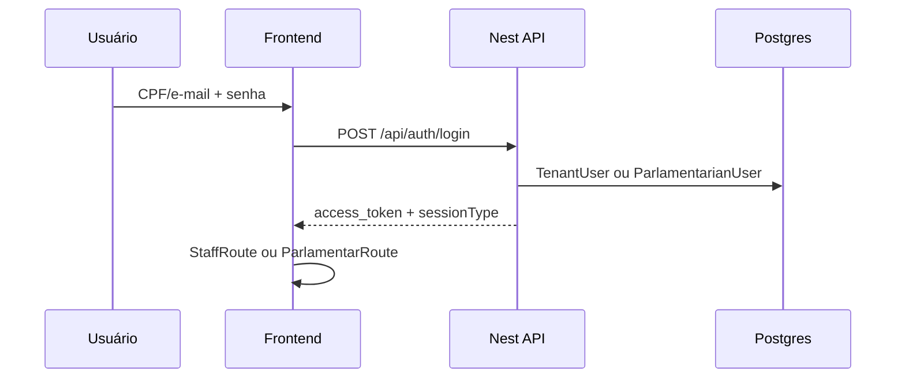
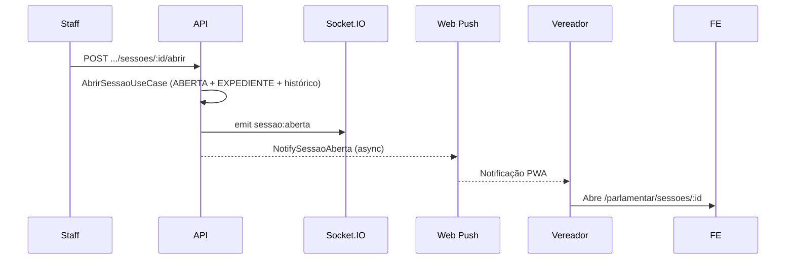
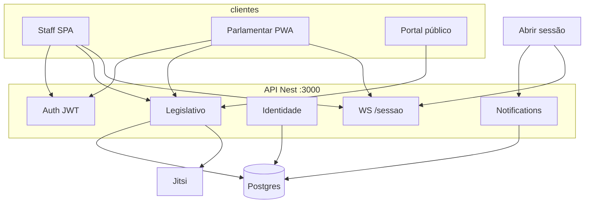

# Arquitetura — GestaoVereadores (SIGL / CâmaraGest)

Documento de arquitetura gerado a partir do código do repositório (agosto/2026).  
Quando houver divergência com `CLAUDE.md` ou specs antigas, **prevalece o código**.

---

## 1. Visão geral

Sistema SaaS **multi-tenant** de gestão legislativa para câmaras municipais brasileiras.


| Camada   | Tecnologia                                                  |
| -------- | ----------------------------------------------------------- |
| API      | NestJS 11 + Fastify                                         |
| Banco    | PostgreSQL + Prisma 6                                       |
| Auth     | JWT (Passport) — staff e parlamentar                        |
| Realtime | Socket.IO (`/sessao`)                                       |
| Push     | Web Push (VAPID)                                            |
| PDF      | Puppeteer                                                   |
| Frontend | React 19 + Vite 6 + PrimeReact 10 + Tailwind 4              |
| PWA      | `vite-plugin-pwa` (injectManifest) + Workbox                |
| Vídeo    | Jitsi Meet (JWT, Docker / VPS)                              |
| Deploy   | Docker Compose · Vercel (API + SPA) · VPS Hostinger (Jitsi) |


**Dois portais autenticados:**

- **Staff** — secretaria / mesa / administração da câmara  
- **Parlamentar** — app do vereador (PWA, presença, voto, sessões)

Há ainda um **portal público** mínimo (resumo de sessão / PDFs) e um **Super Admin** da plataforma (`/super-admin`) para gestão de clientes (tenants).

---


## 2. Estrutura do repositório

```
GestaoVereadores/
├── docker-compose.yml          # postgres · api · frontend · jitsi-*
├── .env.example                # env do Compose (Jitsi, VAPID, etc.)
├── CLAUDE.md                   # regras para agentes (parcialmente desatualizado)
├── ARCHITECTURE.md             # este documento
├── Fluxo_Sessao_Pauta_Votacao_REVISADO.md
├── backend/
│   ├── prisma/                 # schema + migrations + seed
│   ├── src/
│   │   ├── auth/
│   │   ├── identidade/
│   │   ├── legislativo/
│   │   ├── controle-juridico/
│   │   ├── atos-administrativos/
│   │   ├── notifications/      # Web Push
│   │   ├── relatorios/
│   │   ├── common/             # PDF, guards, dominios
│   │   └── docs/               # specs · tasks · ADRs
│   ├── Dockerfile
│   └── vercel.json
├── frontend/
│   ├── src/
│   │   ├── app/routes/         # staff · parlamentar · público
│   │   ├── components/
│   │   ├── pages/
│   │   ├── pwa/                # SW · push · register
│   │   └── api/
│   ├── public/icons/
│   ├── Dockerfile
│   └── vercel.json
└── deploy/
    └── jitsi-vps.env.example   # modelo de env para VPS Hostinger
```


| Pasta                | Papel                                                       |
| -------------------- | ----------------------------------------------------------- |
| `backend/`           | Domínio, auth, Prisma, WebSocket, push, Swagger `/api/docs` |
| `frontend/`          | SPA staff + PWA parlamentar + telas públicas                |
| `deploy/`            | Exemplos de configuração VPS / Jitsi                        |
| `docker-compose.yml` | Orquestra stack local / servidor                            |


---


## 3. Backend


### 3.1 Módulos Nest (`AppModule`)

Guards **globais** (ordem):

1. `JwtAuthGuard`
2. `TenantGuard`
3. `RolesGuard`
4. `TenantRolesGuard`
5. `ThrottlerGuard`

Módulos principais:

- `AuthModule` — login câmara (staff / parlamentar)
- `IdentidadeModule` — User, Tenant, TenantUser, TenantPartner
- `LegislativoModule` — matérias, sessões, votações, agenda, parlamentares, etc.
- `ControleJuridicoModule` — normas
- `AtosAdministrativosModule` — atos
- `NotificationsModule` — subscriptions Web Push
- `RelatoriosModule`, `DominiosModule`, `HealthModule`, `PrismaModule`

Prefixo HTTP: `/api`  
Swagger: `/api/docs`

### 3.2 Camadas por submódulo

```
src/legislativo/<submodulo>/
├── application/     # controllers · dto · use-cases · view-models
├── domain/          # entities · enums · repositories (abstract) · services
└── infra/prisma/    # repositórios Prisma · mappers
```

Fluxo padrão:

```
Controller → UseCase → Domain Service → Prisma Repository → ViewModel
```


### 3.3 Multi-tenant

- JWT carrega `tenantId` + `sessionType: 'staff' | 'parliamentarian'`
- `TenantGuard` valida tenant ativo e preenche `request.tenantId`
- Decorator real: `@TenantId()` (não `@CurrentTenant()`)
- `tenantId` **nunca** vem do body/query/params
- Rotas `@Public()` / `@SkipTenant()` para login, health, VAPID, resumo público

Combos de papel (`auth/guards/guard-combos.ts`):

- `STAFF_AND_ABOVE` — ADMIN_STAFF, STAFF  
- `PARLIAMENTARIAN_ONLY` — sessão parlamentar  
- `ADMIN_ONLY` — ADMIN_STAFF


### 3.4 Regras absolutas (política do projeto)

1. Domain **não** importa `@prisma/client` nem `@nestjs/`*
2. Queries filtram `{ tenantId, isRemoved: false }`
3. Soft delete — nunca `prisma.*.delete()` em entidades de negócio
4. Não alterar migrations já aplicadas
5. Não remover models legados PT (`Parlamentar`, `Comissao`, `MateriaCoautor`, …)
6. `tramitacaoJson` e `cicloVidaJson` são legado — não usar em código novo
7. `TramitacaoHistorico` é append-only
8. Contadores de voto nominais/secretos via query (simbólica permite totais manuais)
9. View Models não expõem `tenantId`, `isRemoved`, `removedAt`, JSONs legados
10. Mensagens de erro em português brasileiro


### 3.5 Domínios de negócio


| Domínio                                              | Caminho                           | Responsabilidade                                         |
| ---------------------------------------------------- | --------------------------------- | -------------------------------------------------------- |
| Matérias                                             | `legislativo/materias/`           | Autoria, tramitação, coautores, publicações              |
| Sessões                                              | `legislativo/sessoes-plenarias/`  | Ciclo de vida, pauta, presença, palavra, Jitsi, PDF, ata |
| Histórico                                            | `legislativo/sessao-historico/`   | Auditoria estruturada da sessão                          |
| Votações                                             | `legislativo/votacoes/`           | Abrir/encerrar, votos, placar (rotas nested em sessões)  |
| Agenda                                               | `legislativo/agenda-legislativa/` | Eventos legislativos                                     |
| Parlamentares                                        | `legislativo/parlamentares/`      | Cadastro EN + mandatos + perfil `/me`                    |
| Mesa / comissões / frentes / partidos / legislaturas | respectivos módulos               | Estrutura política da câmara                             |
| Normas                                               | `controle-juridico/normas/`       | Ciclo jurídico                                           |
| Atos                                                 | `atos-administrativos/atos/`      | Atos administrativos                                     |
| Push                                                 | `notifications/`                  | Subscribe / notify sessão aberta                         |


**Nota estrutural:** pauta, votação, presença e pedido de palavra estão concentrados no `sessoes.controller.ts` (não em controllers separados por submódulo, como algumas specs descrevem).

---


## 4. Modelo de dados (Prisma)

Fonte de verdade: `backend/prisma/schema.prisma`.

### Identidade

```
Tenant ─┬─ TenantUser ── User
        ├─ Parliamentarian ── ParlamentarianUser ── User
        ├─ TenantPartner ── TenantPartnerUser
        └─ PushSubscription (userId · parliamentarianId?)
```

- **Staff** autentica via `TenantUser`  
- **Parlamentar** autentica via `ParlamentarianUser`  
- Modelo canônico do vereador: `Parliamentarian` **(EN)**  
- Modelo legado: `Parlamentar` / `Pessoa` (PT) — preservado


### Sessão plenária

```
SessaoPlenaria
  ├─ statusSessao (AGENDADA | ABERTA | SUSPENSA | ENCERRADA | CANCELADA)
  ├─ faseAtual (NAO_INICIADA | EXPEDIENTE | ORDEM_DO_DIA | ...)
  ├─ Pauta ── PautaItem (MATERIA | ATO | NORMA | AVISO | COMISSAO)
  ├─ PresencaSessao
  ├─ PedidoPalavra
  ├─ Ata (1:1)
  └─ SessaoHistorico (append-only)
```

Votação ligada ao item de pauta:

```
PautaItem ── Votacao ── VotoParlamentar
```

`VotoParlamentar` e `PresencaSessao` aceitam **dupla chave**: `parlamentarId?` (legado) + `parliamentarianId?` (EN).

### Matéria / norma / ato

- `Materia` + `TramitacaoHistorico` + `PublicacaoOficial` + coautores EN/PT  
- `Norma` com datas do ciclo jurídico  
- `Ato` com `tenantId` (ainda nullable no schema — isolar sempre nas queries)


### Push

`PushSubscription`: `endpoint` único, `p256dh`, `auth`, soft delete, vínculo a tenant/user/parlamentar.

---


## 5. Frontend


### 5.1 Shells e rotas


| Shell       | Layout                           | Guard              | Prefixo                                      |
| ----------- | -------------------------------- | ------------------ | -------------------------------------------- |
| Login       | —                                | —                  | `/login`                                     |
| Público     | —                                | —                  | `/publico/...`                               |
| Staff       | `Layout` + topbar mobile         | `StaffRoute`       | `/`, `/materias`, `/sessoes`, `/camara/*`, … |
| Parlamentar | `ParlamentarLayout` + bottom nav | `ParlamentarRoute` | `/parlamentar/*`                             |


Navegação mobile do parlamentar (`MobileBottomNav`):

**Sessões · Matérias · Comissões · Perfil · Mais**

### 5.2 PWA

- Manifest standalone (“CâmaraGest” / SIGL)
- Service worker custom: `frontend/src/pwa/sw.ts`
- Banners: instalar app, atualizar versão, ativar push
- Safe areas, touch targets, sidebar off-canvas


### 5.3 Cliente HTTP / realtime

- `api/client.ts` — Bearer em `localStorage.access_token`
- Paths centralizados em `api/paths.ts`
- `useSessaoRealtime` — Socket.IO namespace `/sessao`

---


## 6. Realtime ([Socket.IO](http://Socket.IO))

Gateway: `backend/src/legislativo/sessoes-plenarias/realtime/sessao-realtime.gateway.ts`

- Namespace: `/sessao`
- Auth: JWT em `handshake.auth.token`
- Salas: `tenant:{tenantId}` e `parlamentar:{parliamentarianId}`


| Evento                                 | Quando                                       |
| -------------------------------------- | -------------------------------------------- |
| `sessao:aberta`                        | Staff abre a sessão                          |
| `sessao:fase`                          | Mudança de fase                              |
| `sessao:encerrada`                     | Encerramento                                 |
| `votacao:aberta` / `votacao:convocada` | Início de votação                            |
| `votacao:placar`                       | Atualização de totais                        |
| `votacao:encerrada`                    | Resultado (secreta não lista votos nominais) |
| `presenca:atualizada`                  | Chamada / auto-presença                      |
| `palavra:*`                            | Pedido de palavra                            |


---


## 7. Fluxos críticos


### Login




### Abrir sessão → notificação push




### Votação

1. Sessão `ABERTA` e item de pauta publicado
2. Staff/presidente abre votação no item
3. Emite `votacao:aberta` / `votacao:convocada`
4. Parlamentar registra voto (ID vem do JWT)
5. Placar em realtime; encerramento grava resultado

---


## 8. Deploy e ambientes


### Docker Compose (local / VPS)


| Serviço     | Porta host  | Função    |
| ----------- | ----------- | --------- |
| `postgres`  | 5433 → 5432 | Banco     |
| `api`       | 3000        | NestJS    |
| `frontend`  | 8080 → 80   | Nginx SPA |
| `jitsi-web` | 8000 / 8444 | Meet      |
| `jitsi-jvb` | UDP 10000   | Mídia     |


Variáveis VAPID / Jitsi na **raiz** (`.env` do Compose) são injetadas no serviço `api`.

### Vercel


| Projeto  | Root        | Observação                                              |
| -------- | ----------- | ------------------------------------------------------- |
| Frontend | `frontend/` | SPA + headers do service worker                         |
| Backend  | `backend/`  | `vercel-build` (Prisma generate + migrate + nest build) |


### VPS Hostinger (Jitsi + opcional stack Docker)

Modelo de env: `deploy/jitsi-vps.env.example`  
Inclui IP/DNS públicos, JWT do Jitsi alinhado à API, CORS e VAPID.

### Variáveis críticas


| Variável                                                           | Uso                           |
| ------------------------------------------------------------------ | ----------------------------- |
| `DATABASE_URL` / `DIRECT_DATABASE_URL`                             | Prisma (runtime + migrations) |
| `JWT_SECRET`                                                       | Tokens da API                 |
| `CORS_ORIGIN`                                                      | Origens permitidas            |
| `VAPID_PUBLIC_KEY` / `VAPID_PRIVATE_KEY` / `VAPID_SUBJECT`         | Web Push                      |
| `JITSI_DOMAIN` / `JITSI_APP_ID` / `JITSI_APP_SECRET` / `JITSI_SUB` | Token de sala                 |
| `VITE_API_URL` / `VITE_SOCKET_URL`                                 | Frontend                      |


---


## 9. Mapa mental




---


## 10. Legado e inconsistências conhecidas


| Item             | Situação                                                                           |
| ---------------- | ---------------------------------------------------------------------------------- |
| `tramitacaoJson` | Legado; trilha canônica é `TramitacaoHistorico` (ainda há caminhos mistos)         |
| `cicloVidaJson`  | Legado; trilha canônica é `SessaoHistorico`                                        |
| Models PT vs EN  | Coexistem; código novo deve preferir EN (`Parliamentarian`, `Board`, …)            |
| `Ato.tenantId`   | Ainda nullable no schema — sempre filtrar por tenant                               |
| `BlocoVotacao`   | Só ADR — **não implementar** sem decisão                                           |
| `CLAUDE.md`      | Atrasado: Ata, SessaoHistorico, push, vários campos de sessão/pauta **já existem** |


---

