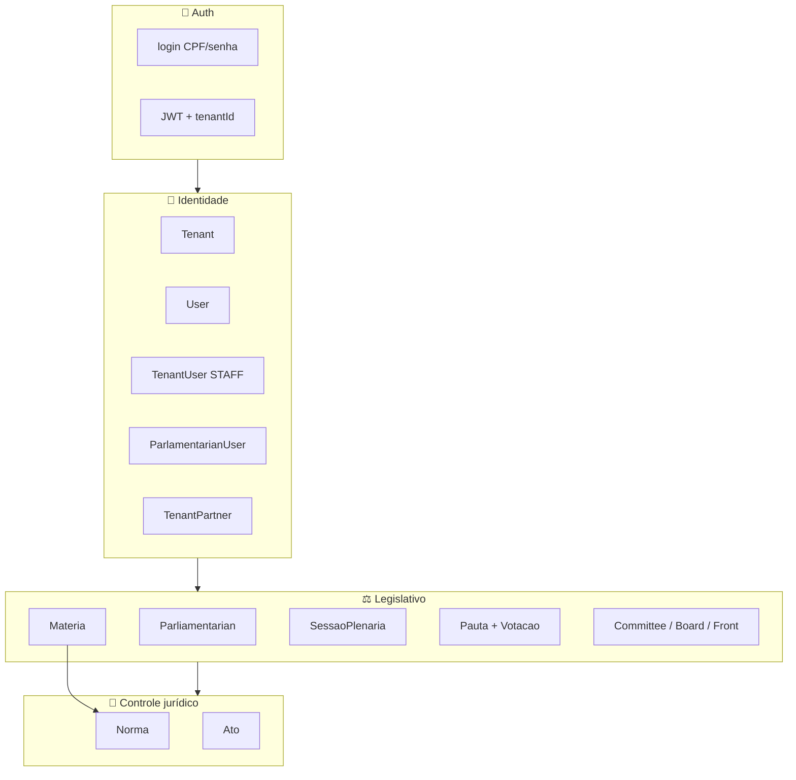

# Wireframe — Backend GestaoVereadores (SIGL)

Mapa visual de **todos os módulos**, **entidades**, **campos** e **rotas API** (`/api/*`).

> Fonte: `prisma/schema.prisma` + controllers NestJS em `backend/src/`.
> Prefixo global: **`/api`**.

---

## Índice

1. [Visão geral](#1-visão-geral)
2. [Autenticação](#2-autenticação)
3. [Identidade / Multi-tenant](#3-identidade--multi-tenant)
4. [Domínios (lookups)](#4-domínios-lookups)
5. [Parlamentares](#5-parlamentares)
6. [Partidos políticos](#6-partidos-políticos)
7. [Legislaturas e mandatos](#7-legislaturas-e-mandatos)
8. [Comissões](#8-comissões)
9. [Mesa diretora](#9-mesa-diretora)
10. [Frentes parlamentares](#10-frentes-parlamentares)
11. [Matérias](#11-matérias)
12. [Sessões plenárias](#12-sessões-plenárias)
13. [Votações](#13-votações)
14. [Agenda legislativa](#14-agenda-legislativa)
15. [Normas jurídicas](#15-normas-jurídicas)
16. [Atos administrativos](#16-atos-administrativos)
17. [Autores externos (Tenant Partner)](#17-autores-externos-tenant-partner)
18. [Relatórios](#18-relatórios)
19. [Modelos legados (PT)](#19-modelos-legados-pt)
20. [Enums](#20-enums)

---

## 1. Visão geral



### Mapa de rotas por módulo

| Módulo | Controller | Base API |
|--------|-----------|----------|
| Health | `health.controller` | `GET /health` |
| Auth | `auth.controller` | `/auth` |
| Usuários SIGL (legado) | `usuarios.controller` (auth) | `/usuarios` |
| Usuários câmara | `usuarios.controller` (identidade) | `/identidade/usuarios` |
| Tenants | `tenants.controller` | `/tenants` |
| Users | `users.controller` | `/users` |
| Tenant users | `tenant-users.controller` | `/tenant-users` |
| Tenant partners | `tenant-partners.controller` | `/identidade/tenant-partners` |
| Domínios | `dominios.controller` | `/dominios` |
| Partidos | `political-parties.controller` | `/legislative/partidos-politicos` |
| Parlamentares | `parliamentarians.controller` | `/legislative/parlamentares` |
| Mandatos | `parlamentar-mandatos.controller` | `/legislative/parlamentares/:id/mandatos` |
| Legislaturas | `legislatures.controller` | `/legislative/legislaturas` |
| Comissões | `comissoes.controller` | `/legislative/comissoes` |
| Mesa diretora | `mesa-diretora.controller` | `/legislative/mesa-diretora` |
| Frentes | `frentes.controller` | `/legislative/frentes-parlamentares` |
| Matérias | `materias.controller` | `/legislative/materias` |
| Sessões | `sessoes.controller` | `/legislative/sessoes-plenarias` |
| Votações | `votacoes.controller` | `/legislative/votacoes` |
| Agenda | `agenda.controller` | `/legislative/agenda-legislativa` |
| Normas | `normas.controller` | `/normas` |
| Atos | `atos.controller` | `/atos` |
| Relatórios | `relatorios.controller` | `/relatorios` |

---

## 2. Autenticação

**API:** `/api/auth`

```
┌─────────────────────────────────────────────────────────┐
│  POST /auth/login          Login staff (CPF + senha)    │
│  POST /auth/login-camara   Login câmara (tenant slug)   │
│  GET  /auth/me             Usuário autenticado          │
└─────────────────────────────────────────────────────────┘
```

### Login (DTO)

| Campo | Tipo | Obrigatório |
|-------|------|-------------|
| cpf | string | sim |
| password | string | sim |

### JWT payload (conceitual)

| Campo | Descrição |
|-------|-----------|
| sub | userId |
| tenantId | tenant ativo |
| sessionType | `staff` \| `parliamentarian` |
| role | ADMIN_STAFF / STAFF (staff) |
| parliamentarianId | (parlamentar) |

---

## 3. Identidade / Multi-tenant

### 3.1 Tenant (Câmara)

**Model:** `Tenant` · **API:** `/tenants`

```
┌──────────────────────────────────────────┐
│  Tenant                                  │
├──────────────────────────────────────────┤
│  id                                      │
│  name              Nome da câmara        │
│  cnpj              Único                 │
│  logo              URL                   │
│  status            ACTIVE|INACTIVE|...   │
│  settings          JSON                    │
│  createdAt / modifiedAt / isRemoved      │
└──────────────────────────────────────────┘
```

### 3.2 User (conta global)

**Model:** `User` · **API:** `/users`

```
┌──────────────────────────────────────────┐
│  User                                    │
├──────────────────────────────────────────┤
│  id                                      │
│  firstName / lastName                    │
│  cpf               Único                 │
│  email             Único                 │
│  passwordHash                            │
│  profilePicture                          │
│  createdAt / modifiedAt / isRemoved      │
└──────────────────────────────────────────┘
```

### 3.3 TenantUser (staff da câmara)

**Model:** `TenantUser` · **API:** `/tenant-users` + `/identidade/usuarios`

```
┌──────────────────────────────────────────┐
│  TenantUser                              │
├──────────────────────────────────────────┤
│  id / tenantId / userId                  │
│  role              ADMIN_STAFF | STAFF   │
│  isTenantAdmin / isTenantStaff           │
│  isParliamentarian                       │
│  permissions       JSON []               │
│  status            ACTIVE|INVITED|...    │
│  lastAccessAt                            │
│  isRemoved / removedAt                   │
└──────────────────────────────────────────┘
```

**Convidar usuário (DTO):** cpf, password, nome, email?, role

### 3.4 ParlamentarianUser (acesso parlamentar)

**Model:** `ParlamentarianUser`

```
┌──────────────────────────────────────────┐
│  ParlamentarianUser                      │
├──────────────────────────────────────────┤
│  id / tenantId                           │
│  parliamentarianId  → Parliamentarian    │
│  userId             → User               │
│  politicalPartyId   → PoliticalParty?    │
│  status             ACTIVE|INACTIVE|...  │
│  lastAccessAt                            │
│  isRemoved / removedAt                   │
└──────────────────────────────────────────┘
```

---

## 4. Domínios (lookups)

**API:** `GET /api/dominios` (por tenant)

Retorna listas para formulários:

| Chave API | Model Prisma | Campos |
|-----------|--------------|--------|
| anos | Ano | id, valor |
| tiposMateria | TipoMateria | id, nome (+ sigla, ordem no schema) |
| tiposListagem | TipoListagem | id, nome |
| tematicas | Tematica | id, nome |
| origensMateria | OrigemMateria | id, nome |
| locaisOrigemExterna | LocalOrigemExterna | id, nome |
| tiposAutor | TipoAutor | id, nome, idNegocio |
| statusTramitacao | StatusTramitacao | id, nome |
| unidadesTramitacao | UnidadeTramitacao | id, nome |
| tiposSessao | TipoSessao | id, nome, codigo |
| situacoesSessao | SituacaoSessao | id, nome, codigo |
| tiposNorma | TipoNorma | id, nome |
| esferasFederacao | EsferaFederacao | id, nome |
| identificadoresNorma | IdentificadorNorma | id, nome |
| tiposAto | TipoAto | id, nome |
| classificacoesAto | ClassificacaoAto | id, nome |
| cargosMesa | CargoMesa | id, nome |
| tiposComissao | TipoComissao | id, nome |

---

## 5. Parlamentares

**API:** `/api/legislative/parlamentares`

### 5.1 Parliamentarian (modelo novo EN)

```
┌─────────────────────────────────────────────────────────────┐
│  Parliamentarian                                            │
├─────────────────────────────────────────────────────────────┤
│  id / tenantId                                              │
│  parliamentaryName    Nome de plenário                      │
│  officeNumber         Gabinete/sala                         │
│  photoUrl             Foto                                  │
│  biography            Biografia                             │
│  status               ACTIVE|INACTIVE|LICENSED|REMOVED      │
│  isRemoved / removedAt / createdAt / updatedAt              │
├─────────────────────────────────────────────────────────────┤
│  Relações: parliamentarianUser, mandates, boardMembers,     │
│  committeeMembers, frontMembers, authoredMatters, votos     │
└─────────────────────────────────────────────────────────────┘
```

### 5.2 Criar parlamentar (DTO)

| Campo | Tipo | Obrigatório |
|-------|------|-------------|
| cpf | string | sim |
| password | string (min 8) | sim |
| parliamentaryName | string | sim |
| email | string | não |
| politicalPartyId | UUID | não |
| officeNumber | string | não |
| photoUrl | string | não |
| biography | string | não |

### 5.3 Endpoints principais

```
GET    /                           Listar
POST   /                           Criar (+ provisiona User)
GET    /:id                        Detalhe
PATCH  /:id                        Atualizar
DELETE /:id                        Soft delete
GET    /me/perfil                  Perfil do parlamentar logado
POST   /:id/acesso                 Conceder acesso
DELETE /:id/acesso                 Revogar acesso
```

---

## 6. Partidos políticos

**API:** `/api/legislative/partidos-politicos`

```
┌──────────────────────────────────────────┐
│  PoliticalParty                          │
├──────────────────────────────────────────┤
│  id / tenantId                           │
│  name                                    │
│  acronym           Sigla (única/tenant)  │
│  ideology                                │
│  flagUrl           Bandeira              │
│  isRemoved / removedAt                   │
│  createdAt / updatedAt                   │
└──────────────────────────────────────────┘
```

---

## 7. Legislaturas e mandatos

### 7.1 Legislature

**API:** `/api/legislative/legislaturas`

```
┌──────────────────────────────────────────┐
│  Legislature                             │
├──────────────────────────────────────────┤
│  id / tenantId                           │
│  number            Número (único/tenant) │
│  startDate / endDate                     │
│  isCurrent         Legislatura vigente   │
│  isRemoved / removedAt                   │
└──────────────────────────────────────────┘
```

### 7.2 ParliamentarianMandate

**API:** `/api/legislative/parlamentares/:id/mandatos`

```
┌──────────────────────────────────────────┐
│  ParliamentarianMandate                  │
├──────────────────────────────────────────┤
│  id / tenantId                           │
│  parliamentarianId                       │
│  legislatureId                           │
│  partyAcronym / partyName                │
│  startedAt / endedAt                     │
│  status            MandateStatus         │
│  isRemoved / removedAt                   │
└──────────────────────────────────────────┘
```

---

## 8. Comissões

**API:** `/api/legislative/comissoes`

### 8.1 Committee

```
┌─────────────────────────────────────────────────────────────┐
│  Committee                                                  │
├─────────────────────────────────────────────────────────────┤
│  id / tenantId                                              │
│  name / acronym                                             │
│  type              PERMANENT | TEMPORARY                    │
│  purpose           Finalidade (text)                        │
│  startDate / endDate                                        │
│  status            ACTIVE|INACTIVE|FINISHED                 │
│  notes                                                      │
│  isRemoved / removedAt                                      │
└─────────────────────────────────────────────────────────────┘
```

### 8.2 CommitteeMember

```
┌──────────────────────────────────────────┐
│  CommitteeMember                         │
├──────────────────────────────────────────┤
│  id / tenantId                           │
│  committeeId                             │
│  parliamentarianId                       │
│  role              PRESIDENT|RAPPORTEUR|  │
│                    MEMBER                │
└──────────────────────────────────────────┘
```

---

## 9. Mesa diretora

**API:** `/api/legislative/mesa-diretora`

### 9.1 Board (mesa)

```
┌──────────────────────────────────────────┐
│  Board                                   │
├──────────────────────────────────────────┤
│  id / tenantId                           │
│  legislatureId                           │
│  name                                    │
│  startDate / endDate                     │
│  status            BoardStatus           │
│  notes                                   │
│  isRemoved / removedAt                   │
└──────────────────────────────────────────┘
```

### 9.2 BoardRole + BoardMember

```
┌──────────────────┐    ┌─────────────────────────────┐
│  BoardRole       │    │  BoardMember                │
├──────────────────┤    ├─────────────────────────────┤
│  id / tenantId   │    │  boardId                    │
│  name            │    │  parliamentarianId          │
└──────────────────┘    │  boardRoleId                │
                        └─────────────────────────────┘
```

---

## 10. Frentes parlamentares

**API:** `/api/legislative/frentes-parlamentares`

```
┌─────────────────────────────────────────────────────────────┐
│  ParliamentaryFront                                         │
├─────────────────────────────────────────────────────────────┤
│  id / tenantId                                              │
│  name / theme / description                                 │
│  startDate / endDate                                        │
│  status            ACTIVE|INACTIVE|FINISHED                 │
│  coordinatorParliamentarianId                               │
│  createdByTenantUserId                                      │
│  isRemoved / removedAt                                      │
└─────────────────────────────────────────────────────────────┘

┌──────────────────────────────────────────┐
│  ParliamentaryFrontMember                  │
├──────────────────────────────────────────┤
│  frontId / parliamentarianId             │
└──────────────────────────────────────────┘
```

---

## 11. Matérias

**API:** `/api/legislative/materias`

### 11.1 Materia (entidade principal)

```
┌─────────────────────────────────────────────────────────────────┐
│  Materia                                                        │
├─────────────────────────────────────────────────────────────────┤
│  IDENTIFICAÇÃO                                                  │
│  • id / tenantId                                                │
│  • tipoId → TipoMateria                                         │
│  • ementa                                                       │
│  • numero / numeroProtocolo                                     │
│  • anoId → Ano                                                  │
│  • sigla                                                        │
│  • status → StatusMateria (enum)                                │
│  • emTramitacao                                                 │
├─────────────────────────────────────────────────────────────────┤
│  CLASSIFICAÇÃO                                                  │
│  • tematicaId / origemId / tipoListagemId                       │
│  • localOrigemExternaId                                         │
│  • statusTramitacaoId / unidadeTramitacaoDestinoId              │
├─────────────────────────────────────────────────────────────────┤
│  DATAS                                                          │
│  • dataApresentacaoInicio / Fim                                 │
│  • dataPublicacaoInicio / Fim                                   │
│  • dataProtocolo                                                │
│  • dataPublicacao                                               │
├─────────────────────────────────────────────────────────────────┤
│  AUTORIA (novo + legado)                                        │
│  • autorId → Autor                                              │
│  • authorParliamentarianId → Parliamentarian                    │
│  • tenantPartnerId (via Autor)                                  │
│  • primeiroAutorId → Parlamentar (legado)                       │
│  • relatorId / rapporteurParliamentarianId                      │
│  • matterCoauthors[] / materiaCoautores[]                       │
│  • materiaAutores[] / representantes[]                          │
├─────────────────────────────────────────────────────────────────┤
│  DOCUMENTOS                                                     │
│  • textoOriginalUrl / textoIntegralUrl / audioUrl               │
│  • veiculoPublicacao / paginaInicio / paginaFim                 │
│  • identificadorPublicacao / urlExternaPublicacao               │
│  • justificativa                                                │
├─────────────────────────────────────────────────────────────────┤
│  LEGADO (não usar em código novo)                               │
│  • tramitacaoJson                                               │
│  • mensagem                                                     │
├─────────────────────────────────────────────────────────────────┤
│  AUDITORIA                                                      │
│  • isRemoved / removedAt / createdAt / updatedAt                │
└─────────────────────────────────────────────────────────────────┘
```

### 11.2 TramitacaoHistorico (append-only)

```
┌──────────────────────────────────────────┐
│  TramitacaoHistorico                     │
├──────────────────────────────────────────┤
│  materiaId                               │
│  dataHora                                │
│  statusAnterior / statusNovo           │
│  unidadeOrigemId / unidadeDestinoId      │
│  responsavelId → TenantUser              │
│  despacho / observacao                   │
└──────────────────────────────────────────┘
```

### 11.3 PublicacaoOficial

```
┌──────────────────────────────────────────┐
│  PublicacaoOficial                       │
├──────────────────────────────────────────┤
│  tenantId / materiaId? / normaId?        │
│  dataPublicacao / veiculo                │
│  paginaInicio / paginaFim                │
│  identificador / urlExterna              │
│  textoIntegral                           │
└──────────────────────────────────────────┘
```

### 11.4 Autor

```
┌──────────────────────────────────────────┐
│  Autor                                   │
├──────────────────────────────────────────┤
│  id / tenantId / nome?                   │
│  tipoAutorId                             │
│  parlamentarId (legado)                  │
│  parliamentarianId (novo)                │
│  tenantPartnerId                         │
└──────────────────────────────────────────┘
```

---

## 12. Sessões plenárias

**API:** `/api/legislative/sessoes-plenarias`

### 12.1 SessaoPlenaria

```
┌─────────────────────────────────────────────────────────────────┐
│  SessaoPlenaria                                                 │
├─────────────────────────────────────────────────────────────────┤
│  id / tenantId                                                  │
│  sessaoLegislativaId → SessaoLegislativa                        │
│  dataInicio / dataFim                                           │
│  tipoSessaoId → TipoSessao                                      │
│  situacaoId → SituacaoSessao                                    │
│  statusSessao → StatusSessao (enum novo)                        │
│  dataAbertura / dataEncerramento / dataSuspensao                │
│  quorumMinimo / quorumPresente                                  │
│  responsavelAberturaId → TenantUser                             │
│  observacoes / mensagem                                         │
│  cicloVidaJson (LEGADO — não usar)                              │
│  isRemoved / createdAt / updatedAt                              │
└─────────────────────────────────────────────────────────────────┘
```

### 12.2 PautaItem

```
┌──────────────────────────────────────────┐
│  PautaItem                               │
├──────────────────────────────────────────┤
│  sessaoId / materiaId                    │
│  ordem / ordemDia                        │
│  fase → FasePauta                        │
│  resultado → ResultadoPauta?             │
│  statusPauta → StatusPautaItem         │
│  publicadaEm                             │
│  → votacao (1:1)                         │
└──────────────────────────────────────────┘
```

### 12.3 PresencaSessao

```
┌──────────────────────────────────────────┐
│  PresencaSessao                          │
├──────────────────────────────────────────┤
│  sessaoId / parlamentarId (legado)       │
│  presente / situacao → SituacaoPresenca  │
│  justificativa                           │
└──────────────────────────────────────────┘
```

### 12.4 Ciclo de vida (endpoints)

```
POST .../abrir      → status ABERTA
POST .../suspender  → status SUSPENSA
POST .../encerrar   → status ENCERRADA
POST .../cancelar   → status CANCELADA
GET/POST pauta      → PautaItem CRUD
POST presenca       → PresencaSessao
```

---

## 13. Votações

**API:** `/api/legislative/votacoes`

### 13.1 Votacao

```
┌─────────────────────────────────────────────────────────────────┐
│  Votacao                                                        │
├─────────────────────────────────────────────────────────────────┤
│  pautaItemId (1:1)                                              │
│  tipoVotacao → NOMINAL | SIMBOLICA | SECRETA                      │
│  exigePresenca                                                  │
│  votosSim / votosNao / abstencoes (legado — calcular via query) │
│  resultado → ResultadoVotacao?                                  │
│  realizadaAt / encerradaAt                                      │
│  responsavelId → TenantUser                                     │
│  quorumVotacao / motivoEmpate / observacoes                     │
└─────────────────────────────────────────────────────────────────┘
```

### 13.2 VotoParlamentar

```
┌──────────────────────────────────────────┐
│  VotoParlamentar                         │
├──────────────────────────────────────────┤
│  votacaoId                               │
│  parlamentarId (legado)                  │
│  parliamentarianId (novo)                │
│  voto → SIM | NAO | ABSTENCAO | PRESENTE │
└──────────────────────────────────────────┘
```

---

## 14. Agenda legislativa

**API:** `/api/legislative/agenda-legislativa`

```
┌─────────────────────────────────────────────────────────────────┐
│  AgendaLegislativa                                              │
├─────────────────────────────────────────────────────────────────┤
│  id / tenantId                                                  │
│  tipo → TipoEventoAgenda (SESSAO|REUNIAO|AUDIENCIA|...)         │
│  numero / titulo / descricao                                    │
│  dataInicio / dataFim                                           │
│  local / mensagem                                               │
│  sessaoPlenariaId → SessaoPlenaria?                             │
│  comissaoId → Committee?                                        │
│  publicoExterno / linkTransmissao                               │
│  recorrencia / recorrenciaPaiId (série)                         │
│  isRemoved / createdAt / updatedAt                              │
└─────────────────────────────────────────────────────────────────┘
```

---

## 15. Normas jurídicas

**API:** `/api/normas`

```
┌─────────────────────────────────────────────────────────────────┐
│  Norma                                                          │
├─────────────────────────────────────────────────────────────────┤
│  id / tenantId                                                  │
│  tipoId → TipoNorma                                             │
│  numero / anoId                                                 │
│  data / ementa                                                  │
│  esferaFederacaoId / identificadorId                            │
│  materiaOrigemId → Materia?                                     │
│  complementar                                                   │
│  textoUrl / textoIntegralUrl / audioUrl                         │
├─────────────────────────────────────────────────────────────────┤
│  CICLO JURÍDICO                                                 │
│  • dataSancao / dataVeto / tipoVeto / motivoVeto                │
│  • dataPromulgacao / dataPublicacao / dataVigencia              │
│  • dataRevogacao / normaRevoganteId                             │
├─────────────────────────────────────────────────────────────────┤
│  dataPublicacaoInicio / Fim / mensagem                          │
│  isRemoved / createdAt / updatedAt                              │
│  → publicacoesOficiais[]                                        │
└─────────────────────────────────────────────────────────────────┘
```

**Uploads:** `POST /:id/texto-integral`, `POST /:id/audio`

---

## 16. Atos administrativos

**API:** `/api/atos`

```
┌─────────────────────────────────────────────────────────────────┐
│  Ato                                                            │
├─────────────────────────────────────────────────────────────────┤
│  id / tenantId (⚠ migrando para NOT NULL)                       │
│  tipoId → TipoAto                                               │
│  classificacaoId → ClassificacaoAto                             │
│  numero / ementa                                                │
│  dataAto / dataInicio / dataFim                                 │
│  dataPublicacaoInicio / Fim                                     │
│  identificadorId → IdentificadorNorma?                          │
│  anexoUrl / textoUrl                                            │
│  mensagem                                                       │
│  isRemoved / removedAt / createdAt / updatedAt                  │
└─────────────────────────────────────────────────────────────────┘
```

---

## 17. Autores externos (Tenant Partner)

**API:** `/api/identidade/tenant-partners`

```
┌─────────────────────────────────────────────────────────────────┐
│  TenantPartner (autor externo / parceiro)                       │
├─────────────────────────────────────────────────────────────────┤
│  id / tenantId / tipoAutorId                                    │
│  nome / cargo / instituicao                                     │
│  cpf / email / telefone / registro                              │
│  partido / uf                                                   │
│  isRemoved / removedAt                                          │
│  → tenantPartnerUser (User vinculado)                           │
│  → autores[] (Autor)                                            │
└─────────────────────────────────────────────────────────────────┘

┌──────────────────────────────────────────┐
│  TenantPartnerUser                       │
├──────────────────────────────────────────┤
│  tenantPartnerId / userId                │
└──────────────────────────────────────────┘
```

---

## 18. Relatórios

**API:** `/api/relatorios`

Endpoints de agregação/exportação (consultar `relatorios.controller.ts`).

---

## 19. Modelos legados (PT)

> Mantidos no schema por compatibilidade. Código **novo** deve usar modelos EN (`Parliamentarian`, `Committee`, `Board`…).

| Legado (PT) | Substituto (EN) |
|-------------|-----------------|
| Parlamentar + Pessoa | Parliamentarian + User |
| Comissao + ComissaoMembro | Committee + CommitteeMember |
| FrenteParlamentar + FrenteMembro | ParliamentaryFront + Member |
| Legislatura + ParlamentarMandato | Legislature + ParliamentarianMandate |
| MesaDiretora + MesaDiretoraMembro | Board + BoardMember |
| MateriaCoautor | MatterCoauthor |
| Usuario (username) | User + TenantUser |

### Pessoa (cadastro legado)

```
nome, nomeParlamentar, cpf, rg, tituloEleitor, dataNascimento, sexo,
email, telefone, celular, endereço completo, site
```

### Parlamentar (legado)

```
pessoaId, partido, profissao, gabinete, situacaoMilitar, nivelInstrucao,
fotoUrl, biografia, ativo, mensagem
```

### Comissao (legado — campos extras vs Committee)

```
nome, sigla, tipoComissaoId, datas (criação, extinção, instalação, término),
contatos (tel, email, endereço secretaria), finalidade, apelido, ativa
```

---

## 20. Enums

| Enum | Valores |
|------|---------|
| TenantStatus | ACTIVE, INACTIVE, SUSPENDED |
| TenantUserRole | ADMIN_STAFF, STAFF |
| TenantUserStatus | ACTIVE, INVITED, DISABLED |
| ParlamentarianUserStatus | ACTIVE, INACTIVE, SUSPENDED |
| ParliamentarianStatus | ACTIVE, INACTIVE, LICENSED, REMOVED |
| MandateStatus | ACTIVE, FINISHED, INTERRUPTED, LICENSED |
| StatusMateria | DRAFT, PROTOCOLADA, EM_TRAMITACAO, EM_PAUTA, APROVADA, REJEITADA, ARQUIVADA, RETIRADA, TRANSFORMADA_EM_NORMA |
| StatusSessao | AGENDADA, ABERTA, SUSPENSA, ENCERRADA, CANCELADA |
| StatusPautaItem | RASCUNHO, PUBLICADA, ENCERRADA |
| CommitteeType | PERMANENT, TEMPORARY |
| CommitteeMemberRole | PRESIDENT, RAPPORTEUR, MEMBER |
| TipoVotacao | NOMINAL, SIMBOLICA, SECRETA |
| Voto | SIM, NAO, ABSTENCAO, PRESENTE |
| TipoEventoAgenda | SESSAO, REUNIAO, AUDIENCIA, EVENTO, COMPROMISSO |
| CourseStatus | DRAFT, PUBLISHED, ARCHIVED |

---

## Fluxo legislativo (wireframe de processo)

```
  [Parlamentar/Autor externo]
           │
           ▼
    ┌─────────────┐     tramitar      ┌──────────────────┐
    │   Materia   │ ───────────────►  │ TramitacaoHist.  │
    └──────┬──────┘                   └──────────────────┘
           │ incluir em pauta
           ▼
    ┌─────────────┐     abrir         ┌──────────────────┐
    │ SessaoPlen. │ ◄──────────────── │   PautaItem      │
    └──────┬──────┘                   └────────┬─────────┘
           │                                   │
           │ presença                          ▼
           ▼                            ┌─────────────┐
    ┌─────────────┐                     │   Votacao   │
    │  Presenca   │                     └──────┬──────┘
    └─────────────┘                            │
                                               ▼
                                        ┌─────────────┐
                                        │    Norma    │
                                        └─────────────┘
```

---

## Campos ocultos na API (nunca expor em View Models)

- `tenantId`
- `isRemoved` / `removedAt`
- `tramitacaoJson` / `cicloVidaJson`
- `passwordHash`

---

*Gerado a partir do schema Prisma e controllers em mar/2026. Atualizar quando migrations forem aplicadas (TASK-001+).*
