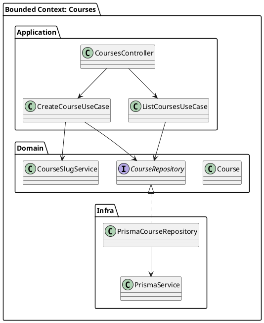

# ARCH-001-backend-ddd-multitenant

## Background

The backend is organized as a modular monolith using DDD-inspired boundaries.

The goal is to keep each business capability isolated by **Module / Bounded Context / Domain Context**.

This improves maintenance, debugging, ownership, testing, and future scalability.

A bounded context should be designed as a potential future microservice boundary.

---

## Architectural Principles

### 1. Separate by business context

The project must be organized by context:

```txt
src/courses/
src/enrollments/
src/certificates/
src/tenants/
src/users/
```

Avoid global technical folders like:

```txt
src/controllers/
src/services/
src/repositories/
```

The preferred architecture keeps all files related to a business capability inside the same module.

---

### 2. Why this separation matters

Separating by Module / Bounded Context / Domain Context provides:

- Easier maintenance.
- Easier debugging.
- Clear ownership of business rules.
- Less coupling between unrelated features.
- Easier testing.
- Easier future migration from monolith to microservices.

When the application scales, a context such as `courses`, `enrollments`, or `certificates` can be extracted with less refactoring because its application, domain, and infra code are already isolated.

---

## Standard Context Structure

```txt
src/<bounded-context>/
├── <bounded-context>.module.ts
├── application/
│   ├── controllers/
│   ├── dto/
│   ├── use-cases/
│   └── view-models/
├── domain/
│   ├── entities/
│   ├── enums/
│   ├── repositories/
│   ├── services/
│   ├── factories/
│   ├── builders/
│   └── facades/
└── infra/
    ├── prisma/
    ├── repositories/
    └── integrations/
```

---

## Layer Responsibilities

### Application

Application is responsible for orchestration.

It contains:

- Controllers
- DTOs
- Use Cases
- View Models

Controllers receive requests and call use cases.

Use cases execute application actions and coordinate domain and infra contracts.

Application should not contain Prisma-specific queries.

---

### Domain

Domain contains business rules.

It contains:

- Entities
- Enums
- Repository contracts
- Domain services
- Factories
- Builders
- Facades

The domain layer must not know about HTTP, Prisma, database details, external APIs, or NestJS infrastructure.

---

### Infra

Infra contains technical implementations.

It contains:

- Prisma repositories
- External API clients
- Integrations
- ORM-specific code

Infra implements contracts defined by the domain layer.

---

## Dependency Direction

Dependencies must point inward.

```txt
Application → Domain
Infra → Domain
Controller → Use Case → Domain Contract → Infra Implementation
```

The domain layer must remain independent.

---

## PlantUML — Context Architecture



---

## Bounded Context Communication

A context must not directly access another context's infra layer.

Avoid:

```ts
import { PrismaEnrollmentRepository } from '@/enrollments/infra/prisma/prisma-enrollment.repository';
```

Prefer public contracts or facades:

```ts
import { EnrollmentFacade } from '@/enrollments/domain/facades/enrollment.facade';
```

When contexts need to communicate, use:

1. Application use cases
2. Public facades
3. Domain events
4. Integration services
5. Explicit contracts

---

## Multi-Tenancy

Tenant-owned entities must always be filtered by `tenantId`.

The `tenantId` must come from the authenticated request context.

Never accept `tenantId` from:

- Body
- Query params
- Route params

Example repository query:

```ts
await prisma.course.findFirst({
    where: {
        id,
        tenantId,
        isRemoved: false,
    },
});
```

---

## Soft Delete

Tenant-owned business records should use soft delete.

Required fields:

```prisma
isRemoved Boolean   @default(false)
removedAt DateTime?
```

Use:

```ts
await prisma.course.update({
    where: { id },
    data: {
        isRemoved: true,
        removedAt: new Date(),
    },
});
```

Do not use physical delete for business records unless explicitly documented.

---

## Migration to Microservices

The application begins as a modular monolith.

A context may later become a microservice when:

- It has independent business lifecycle.
- It has different scaling needs.
- It has separate ownership.
- It integrates with external systems independently.
- Its database access can be isolated.

To prepare for this:

- Keep context boundaries explicit.
- Keep use cases inside the owning context.
- Avoid cross-context database joins where possible.
- Avoid importing another context's infra classes.
- Use facades, contracts, events, or integrations for communication.

---

## Example Contexts

Recommended contexts for a course platform:

```txt
src/courses/
src/course-modules/
src/course-lessons/
src/enrollments/
src/progress/
src/certificates/
```

Depending on complexity, `course-modules` and `course-lessons` may either start inside `courses` or become separate contexts later.

The decision should be documented in `docs/specs/`.
