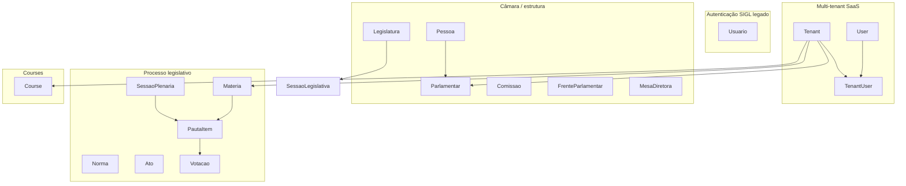
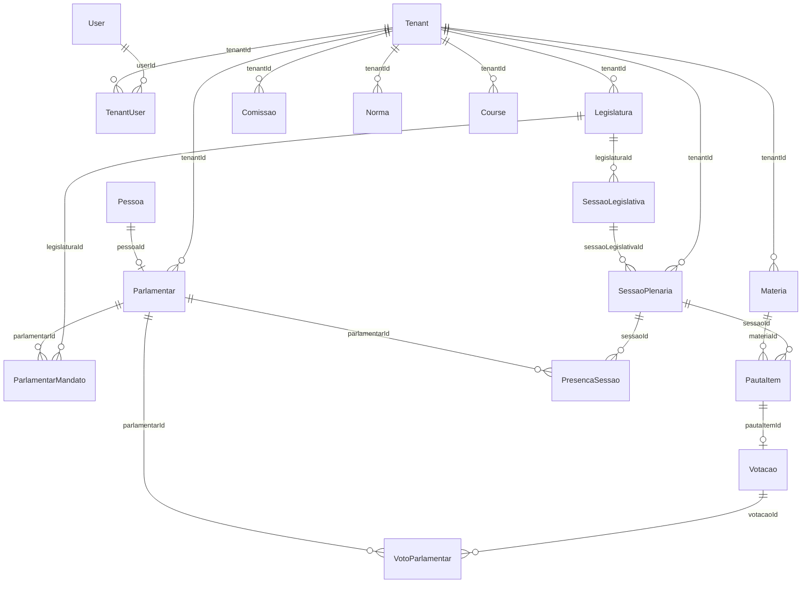
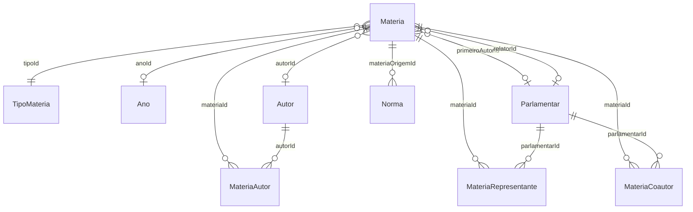

# Relacionamentos do banco — Prisma Schema

Documento gerado a partir de `backend/prisma/schema.prisma`.

**Legenda de cardinalidade**

| Notação | Significado |
|---------|-------------|
| `1:1` | Um para um |
| `1:N` | Um para muitos |
| `N:1` | Muitos para um |
| `N:M` | Muitos para muitos (via tabela de junção) |

**Colunas especiais recorrentes**

| Campo | Uso |
|-------|-----|
| `tenantId` | Isolamento multi-tenant (SaaS) |
| `isRemoved` | Soft delete |
| `removedAt` | Data do soft delete (`Course`) |

---

## Visão geral por domínio

---

## 1. Multi-tenant (SaaS)

### `User`

| Relacionamento | Tipo | Campo FK | Referência | `onDelete` |
|----------------|------|----------|------------|------------|
| Usuário → vínculos com tenants | `1:N` | — | `TenantUser.userId` | — |

**Constraints:** `cpf` UNIQUE, `email` UNIQUE

---

### `Tenant`

| Relacionamento | Tipo | Campo FK | Referência | `onDelete` |
|----------------|------|----------|------------|------------|
| Tenant → usuários vinculados | `1:N` | — | `TenantUser.tenantId` | Cascade |
| Tenant → parlamentares | `1:N` | — | `Parlamentar.tenantId` | — |
| Tenant → legislaturas | `1:N` | — | `Legislatura.tenantId` | — |
| Tenant → comissões | `1:N` | — | `Comissao.tenantId` | — |
| Tenant → frentes parlamentares | `1:N` | — | `FrenteParlamentar.tenantId` | — |
| Tenant → matérias | `1:N` | — | `Materia.tenantId` | — |
| Tenant → autores | `1:N` | — | `Autor.tenantId` | — |
| Tenant → normas | `1:N` | — | `Norma.tenantId` | — |
| Tenant → sessões plenárias | `1:N` | — | `SessaoPlenaria.tenantId` | — |
| Tenant → tipos de matéria | `1:N` | — | `TipoMateria.tenantId` | — |
| Tenant → tipos de comissão | `1:N` | — | `TipoComissao.tenantId` | — |
| Tenant → tipos de autor | `1:N` | — | `TipoAutor.tenantId` | — |
| Tenant → tipos de sessão | `1:N` | — | `TipoSessao.tenantId` | — |
| Tenant → cargos da mesa | `1:N` | — | `CargoMesa.tenantId` | — |
| Tenant → mesas diretoras | `1:N` | — | `MesaDiretora.tenantId` | — |
| Tenant → agendas legislativas | `1:N` | — | `AgendaLegislativa.tenantId` | — |
| Tenant → cursos | `1:N` | — | `Course.tenantId` | — |

**Constraints:** `cnpj` UNIQUE

---

### `TenantUser` (junção User ↔ Tenant)

| Relacionamento | Tipo | Campo FK | Referência | `onDelete` |
|----------------|------|----------|------------|------------|
| Vínculo → tenant | `N:1` | `tenantId` | `Tenant.id` | Cascade |
| Vínculo → user | `N:1` | `userId` | `User.id` | Cascade |

**Constraints:** UNIQUE `[tenantId, userId]` · INDEX `[tenantId]` · INDEX `[userId]`

---

## 2. Autenticação SIGL (legado)

### `Usuario`

Modelo **isolado** — sem relacionamentos Prisma com outras entidades.

**Constraints:** `username` UNIQUE

---

## 3. Domínios auxiliares (catálogos)

### Catálogos globais (sem `tenantId`)

| Modelo | Relacionamentos de saída (`1:N`) |
|--------|----------------------------------|
| `Ano` | → `Materia`, `Norma` |
| `TipoListagem` | → `Materia` |
| `Tematica` | → `Materia` |
| `OrigemMateria` | → `Materia` |
| `LocalOrigemExterna` | → `Materia` |
| `StatusTramitacao` | → `Materia` |
| `UnidadeTramitacao` | → `Materia` |
| `SituacaoSessao` | → `SessaoPlenaria` |
| `EsferaFederacao` | → `Norma` |
| `IdentificadorNorma` | → `Norma` |
| `TipoNorma` | → `Norma` |
| `ClassificacaoAto` | → `Ato` |
| `TipoAto` | → `Ato` |

Todos possuem `nome` UNIQUE (exceto `Ano`, que usa `valor` UNIQUE).

---

### Catálogos por tenant

| Modelo | Relacionamento | Tipo | Campo FK | Referência |
|--------|----------------|------|----------|------------|
| `TipoMateria` | → tenant | `N:1` | `tenantId` | `Tenant.id` |
| `TipoMateria` | → matérias | `1:N` | — | `Materia.tipoId` |
| `TipoAutor` | → tenant | `N:1` | `tenantId` | `Tenant.id` |
| `TipoAutor` | → autores | `1:N` | — | `Autor.tipoAutorId` |
| `TipoSessao` | → tenant | `N:1` | `tenantId` | `Tenant.id` |
| `TipoSessao` | → sessões plenárias | `1:N` | — | `SessaoPlenaria.tipoSessaoId` |
| `TipoComissao` | → tenant | `N:1` | `tenantId` | `Tenant.id` |
| `TipoComissao` | → comissões | `1:N` | — | `Comissao.tipoComissaoId` |
| `CargoMesa` | → tenant | `N:1` | `tenantId` | `Tenant.id` |
| `CargoMesa` | → membros da mesa | `1:N` | — | `MesaDiretoraMembro.cargoId` |

**Constraints por tenant:** UNIQUE `[tenantId, nome]` em `TipoMateria`, `TipoAutor`, `TipoSessao`, `TipoComissao`, `CargoMesa`

---

## 4. Cadastros estruturais

### `Pessoa` ↔ `Parlamentar`

| Relacionamento | Tipo | Campo FK | Referência | `onDelete` |
|----------------|------|----------|------------|------------|
| Pessoa → parlamentar | `1:1` | `Parlamentar.pessoaId` | `Pessoa.id` | Cascade |

**Constraints:** `Parlamentar.pessoaId` UNIQUE · `Pessoa.cpf` UNIQUE (opcional)

---

### `Parlamentar`

| Relacionamento | Tipo | Campo FK | Referência | `onDelete` |
|----------------|------|----------|------------|------------|
| → tenant | `N:1` | `tenantId` | `Tenant.id` | — |
| → pessoa | `1:1` | `pessoaId` | `Pessoa.id` | Cascade |
| → mandatos | `1:N` | — | `ParlamentarMandato.parlamentarId` | Cascade |
| → autores | `1:N` | — | `Autor.parlamentarId` | — |
| → matérias como relator | `1:N` | — | `Materia.relatorId` | — |
| → matérias como 1º autor | `1:N` | — | `Materia.primeiroAutorId` | — |
| → membros de mesa | `1:N` | — | `MesaDiretoraMembro.parlamentarId` | — |
| → membros de comissão | `1:N` | — | `ComissaoMembro.parlamentarId` | — |
| → membros de frente | `1:N` | — | `FrenteMembro.parlamentarId` | — |
| → presenças em sessão | `1:N` | — | `PresencaSessao.parlamentarId` | — |
| → votos | `1:N` | — | `VotoParlamentar.parlamentarId` | — |
| → representantes de matéria | `1:N` | — | `MateriaRepresentante.parlamentarId` | — |
| → coautorias de matéria | `1:N` | — | `MateriaCoautor.parlamentarId` | — |

**Index:** `[tenantId]`

---

### `Autor`

| Relacionamento | Tipo | Campo FK | Referência |
|----------------|------|----------|------------|
| → tenant | `N:1` | `tenantId` | `Tenant.id` |
| → tipo de autor | `N:1` | `tipoAutorId` | `TipoAutor.id` |
| → parlamentar (opcional) | `N:1` | `parlamentarId` | `Parlamentar.id` |
| → matérias (autor principal) | `1:N` | — | `Materia.autorId` |
| → matérias (N:M via junção) | `N:M` | — | `MateriaAutor` |

**Index:** `[tenantId]`

---

### `Comissao`

| Relacionamento | Tipo | Campo FK | Referência |
|----------------|------|----------|------------|
| → tenant | `N:1` | `tenantId` | `Tenant.id` |
| → tipo de comissão (opcional) | `N:1` | `tipoComissaoId` | `TipoComissao.id` |
| → membros | `1:N` | — | `ComissaoMembro.comissaoId` |

**Constraints:** UNIQUE `[tenantId, sigla]` · INDEX `[tenantId]`

---

### `ComissaoMembro` (junção Comissão ↔ Parlamentar)

| Relacionamento | Tipo | Campo FK | Referência | `onDelete` |
|----------------|------|----------|------------|------------|
| → comissão | `N:1` | `comissaoId` | `Comissao.id` | Cascade |
| → parlamentar | `N:1` | `parlamentarId` | `Parlamentar.id` | — |

**Constraints:** UNIQUE `[comissaoId, parlamentarId]`

---

### `FrenteParlamentar`

| Relacionamento | Tipo | Campo FK | Referência |
|----------------|------|----------|------------|
| → tenant | `N:1` | `tenantId` | `Tenant.id` |
| → membros | `1:N` | — | `FrenteMembro.frenteId` |

**Index:** `[tenantId]`

---

### `FrenteMembro` (junção Frente ↔ Parlamentar)

| Relacionamento | Tipo | Campo FK | Referência | `onDelete` |
|----------------|------|----------|------------|------------|
| → frente | `N:1` | `frenteId` | `FrenteParlamentar.id` | Cascade |
| → parlamentar | `N:1` | `parlamentarId` | `Parlamentar.id` | — |

**Constraints:** UNIQUE `[frenteId, parlamentarId]`

---

## 5. Legislatura e sessões

### `Legislatura`

| Relacionamento | Tipo | Campo FK | Referência |
|----------------|------|----------|------------|
| → tenant | `N:1` | `tenantId` | `Tenant.id` |
| → sessões legislativas | `1:N` | — | `SessaoLegislativa.legislaturaId` |
| → mesas diretoras | `1:N` | — | `MesaDiretora.legislaturaId` |
| → mandatos de parlamentares | `1:N` | — | `ParlamentarMandato.legislaturaId` |

**Constraints:** UNIQUE `[tenantId, numero]` · INDEX `[tenantId]`

---

### `ParlamentarMandato` (junção Parlamentar ↔ Legislatura)

| Relacionamento | Tipo | Campo FK | Referência | `onDelete` |
|----------------|------|----------|------------|------------|
| → parlamentar | `N:1` | `parlamentarId` | `Parlamentar.id` | Cascade |
| → legislatura | `N:1` | `legislaturaId` | `Legislatura.id` | Cascade |

**Constraints:** UNIQUE `[parlamentarId, legislaturaId]` · INDEX `[legislaturaId]`

---

### `SessaoLegislativa`

| Relacionamento | Tipo | Campo FK | Referência | `onDelete` |
|----------------|------|----------|------------|------------|
| → legislatura | `N:1` | `legislaturaId` | `Legislatura.id` | Cascade |
| → sessões plenárias | `1:N` | — | `SessaoPlenaria.sessaoLegislativaId` | — |

**Constraints:** UNIQUE `[legislaturaId, numero]`

---

### `SessaoPlenaria`

| Relacionamento | Tipo | Campo FK | Referência |
|----------------|------|----------|------------|
| → tenant | `N:1` | `tenantId` | `Tenant.id` |
| → sessão legislativa (opcional) | `N:1` | `sessaoLegislativaId` | `SessaoLegislativa.id` |
| → tipo de sessão | `N:1` | `tipoSessaoId` | `TipoSessao.id` |
| → situação | `N:1` | `situacaoId` | `SituacaoSessao.id` |
| → mesas diretoras | `1:N` | — | `MesaDiretora.sessaoId` |
| → itens de pauta | `1:N` | — | `PautaItem.sessaoId` |
| → presenças | `1:N` | — | `PresencaSessao.sessaoId` |

**Index:** `[tenantId]`

---

### `MesaDiretora`

| Relacionamento | Tipo | Campo FK | Referência |
|----------------|------|----------|------------|
| → tenant | `N:1` | `tenantId` | `Tenant.id` |
| → legislatura | `N:1` | `legislaturaId` | `Legislatura.id` |
| → sessão plenária (opcional) | `N:1` | `sessaoId` | `SessaoPlenaria.id` |
| → membros | `1:N` | — | `MesaDiretoraMembro.mesaId` |

**Index:** `[tenantId]`

---

### `MesaDiretoraMembro` (junção Mesa ↔ Parlamentar ↔ Cargo)

| Relacionamento | Tipo | Campo FK | Referência | `onDelete` |
|----------------|------|----------|------------|------------|
| → mesa | `N:1` | `mesaId` | `MesaDiretora.id` | Cascade |
| → parlamentar | `N:1` | `parlamentarId` | `Parlamentar.id` | — |
| → cargo | `N:1` | `cargoId` | `CargoMesa.id` | — |

**Constraints:** UNIQUE `[mesaId, cargoId]`

---

## 6. Processo legislativo

### `Materia`

| Relacionamento | Tipo | Campo FK | Referência | Nome Prisma |
|----------------|------|----------|------------|-------------|
| → tenant | `N:1` | `tenantId` | `Tenant.id` | — |
| → tipo | `N:1` | `tipoId` | `TipoMateria.id` | — |
| → ano (opcional) | `N:1` | `anoId` | `Ano.id` | — |
| → temática (opcional) | `N:1` | `tematicaId` | `Tematica.id` | — |
| → origem (opcional) | `N:1` | `origemId` | `OrigemMateria.id` | — |
| → tipo listagem (opcional) | `N:1` | `tipoListagemId` | `TipoListagem.id` | — |
| → autor (opcional) | `N:1` | `autorId` | `Autor.id` | `AutorMateria` |
| → 1º autor parlamentar (opcional) | `N:1` | `primeiroAutorId` | `Parlamentar.id` | `PrimeiroAutorMateria` |
| → relator (opcional) | `N:1` | `relatorId` | `Parlamentar.id` | `RelatorMateria` |
| → local origem externa (opcional) | `N:1` | `localOrigemExternaId` | `LocalOrigemExterna.id` | — |
| → unidade tramitação destino (opcional) | `N:1` | `unidadeTramitacaoDestinoId` | `UnidadeTramitacao.id` | — |
| → status tramitação (opcional) | `N:1` | `statusTramitacaoId` | `StatusTramitacao.id` | — |
| → itens de pauta | `1:N` | — | `PautaItem.materiaId` | — |
| → autores (N:M) | `N:M` | — | `MateriaAutor` | — |
| → representantes (N:M) | `N:M` | — | `MateriaRepresentante` | — |
| → coautores (N:M) | `N:M` | — | `MateriaCoautor` | — |
| → normas originadas | `1:N` | — | `Norma.materiaOrigemId` | — |

**Constraints:** UNIQUE `[tenantId, tipoId, numero, anoId]` · INDEX `[tenantId]` · INDEX `[tenantId, status]`

---

### `MateriaAutor` (junção Matéria ↔ Autor)

| Relacionamento | Tipo | Campo FK | Referência | `onDelete` |
|----------------|------|----------|------------|------------|
| → matéria | `N:1` | `materiaId` | `Materia.id` | Cascade |
| → autor | `N:1` | `autorId` | `Autor.id` | — |

**Constraints:** UNIQUE `[materiaId, autorId]` · UNIQUE `[materiaId, ordem]`

---

### `MateriaRepresentante` (junção Matéria ↔ Parlamentar)

| Relacionamento | Tipo | Campo FK | Referência | `onDelete` |
|----------------|------|----------|------------|------------|
| → matéria | `N:1` | `materiaId` | `Materia.id` | Cascade |
| → parlamentar | `N:1` | `parlamentarId` | `Parlamentar.id` | — |

**Constraints:** UNIQUE `[materiaId, parlamentarId]` · UNIQUE `[materiaId, ordem]`

---

### `MateriaCoautor` (junção Matéria ↔ Parlamentar)

| Relacionamento | Tipo | Campo FK | Referência | `onDelete` |
|----------------|------|----------|------------|------------|
| → matéria | `N:1` | `materiaId` | `Materia.id` | Cascade |
| → parlamentar | `N:1` | `parlamentarId` | `Parlamentar.id` | — |

**Constraints:** UNIQUE `[materiaId, parlamentarId]` · UNIQUE `[materiaId, ordem]`

---

### `Norma`

| Relacionamento | Tipo | Campo FK | Referência |
|----------------|------|----------|------------|
| → tenant | `N:1` | `tenantId` | `Tenant.id` |
| → tipo | `N:1` | `tipoId` | `TipoNorma.id` |
| → ano (opcional) | `N:1` | `anoId` | `Ano.id` |
| → esfera federação (opcional) | `N:1` | `esferaFederacaoId` | `EsferaFederacao.id` |
| → identificador (opcional) | `N:1` | `identificadorId` | `IdentificadorNorma.id` |
| → matéria origem (opcional) | `N:1` | `materiaOrigemId` | `Materia.id` |

**Index:** `[tenantId]`

---

### `Ato`

| Relacionamento | Tipo | Campo FK | Referência |
|----------------|------|----------|------------|
| → tipo | `N:1` | `tipoId` | `TipoAto.id` |
| → classificação | `N:1` | `classificacaoId` | `ClassificacaoAto.id` |

> **Nota:** `Ato` não possui `tenantId` no schema atual — catálogo e registro são globais.

---

### `AgendaLegislativa`

| Relacionamento | Tipo | Campo FK | Referência |
|----------------|------|----------|------------|
| → tenant | `N:1` | `tenantId` | `Tenant.id` |

**Index:** `[tenantId]`

---

## 7. Sessão plenária — pauta, votação e presença

### `PautaItem` (junção Sessão ↔ Matéria)

| Relacionamento | Tipo | Campo FK | Referência | `onDelete` |
|----------------|------|----------|------------|------------|
| → sessão | `N:1` | `sessaoId` | `SessaoPlenaria.id` | Cascade |
| → matéria | `N:1` | `materiaId` | `Materia.id` | — |
| → votação | `1:1` | — | `Votacao.pautaItemId` | — |

**Constraints:** UNIQUE `[sessaoId, materiaId]` · UNIQUE `[sessaoId, ordem]`

---

### `Votacao`

| Relacionamento | Tipo | Campo FK | Referência | `onDelete` |
|----------------|------|----------|------------|------------|
| → item de pauta | `1:1` | `pautaItemId` | `PautaItem.id` | Cascade |
| → votos nominais | `1:N` | — | `VotoParlamentar.votacaoId` | Cascade |

**Constraints:** `pautaItemId` UNIQUE

---

### `VotoParlamentar` (junção Votação ↔ Parlamentar)

| Relacionamento | Tipo | Campo FK | Referência | `onDelete` |
|----------------|------|----------|------------|------------|
| → votação | `N:1` | `votacaoId` | `Votacao.id` | Cascade |
| → parlamentar | `N:1` | `parlamentarId` | `Parlamentar.id` | — |

**Constraints:** UNIQUE `[votacaoId, parlamentarId]`

---

### `PresencaSessao` (junção Sessão ↔ Parlamentar)

| Relacionamento | Tipo | Campo FK | Referência | `onDelete` |
|----------------|------|----------|------------|------------|
| → sessão | `N:1` | `sessaoId` | `SessaoPlenaria.id` | Cascade |
| → parlamentar | `N:1` | `parlamentarId` | `Parlamentar.id` | — |

**Constraints:** UNIQUE `[sessaoId, parlamentarId]`

---

## 8. Courses (bounded context)

### `Course`

| Relacionamento | Tipo | Campo FK | Referência |
|----------------|------|----------|------------|
| → tenant | `N:1` | `tenantId` | `Tenant.id` |

**Tabela física:** `courses` (`@@map`)

**Constraints:** UNIQUE `[tenantId, slug]` · INDEX `[tenantId, isRemoved]` · INDEX `[tenantId, status]`

---

## 9. Diagrama ER — núcleo multi-tenant

---

## 10. Diagrama ER — matéria e autoria

---

## 11. Tabelas de junção (N:M)

| Tabela | Entidade A | Entidade B | UNIQUE composto |
|--------|------------|------------|-----------------|
| `TenantUser` | `User` | `Tenant` | `[tenantId, userId]` |
| `ComissaoMembro` | `Comissao` | `Parlamentar` | `[comissaoId, parlamentarId]` |
| `FrenteMembro` | `FrenteParlamentar` | `Parlamentar` | `[frenteId, parlamentarId]` |
| `ParlamentarMandato` | `Parlamentar` | `Legislatura` | `[parlamentarId, legislaturaId]` |
| `MesaDiretoraMembro` | `MesaDiretora` | `Parlamentar` + `CargoMesa` | `[mesaId, cargoId]` |
| `MateriaAutor` | `Materia` | `Autor` | `[materiaId, autorId]`, `[materiaId, ordem]` |
| `MateriaRepresentante` | `Materia` | `Parlamentar` | `[materiaId, parlamentarId]`, `[materiaId, ordem]` |
| `MateriaCoautor` | `Materia` | `Parlamentar` | `[materiaId, parlamentarId]`, `[materiaId, ordem]` |
| `PautaItem` | `SessaoPlenaria` | `Materia` | `[sessaoId, materiaId]`, `[sessaoId, ordem]` |
| `VotoParlamentar` | `Votacao` | `Parlamentar` | `[votacaoId, parlamentarId]` |
| `PresencaSessao` | `SessaoPlenaria` | `Parlamentar` | `[sessaoId, parlamentarId]` |

---

## 12. Entidades sem relacionamento Prisma

| Modelo | Observação |
|--------|------------|
| `Usuario` | Auth SIGL legado; sem FKs no schema |
| `Ano`, `Tematica`, `OrigemMateria`, etc. | Apenas relações de saída (`1:N`) para matérias/normas/atos |

---

## 13. Resumo — entidades com `tenantId`

Toda consulta de negócio multi-tenant deve filtrar por `tenantId` + `isRemoved: false` quando aplicável.

| Modelo | `tenantId` | `isRemoved` |
|--------|:----------:|:-----------:|
| `TenantUser` | ✓ | ✓ |
| `Parlamentar` | ✓ | ✓ |
| `Autor` | ✓ | ✓ |
| `Comissao` | ✓ | ✓ |
| `FrenteParlamentar` | ✓ | ✓ |
| `Legislatura` | ✓ | ✓ |
| `SessaoPlenaria` | ✓ | ✓ |
| `MesaDiretora` | ✓ | ✓ |
| `Materia` | ✓ | ✓ |
| `Norma` | ✓ | ✓ |
| `AgendaLegislativa` | ✓ | ✓ |
| `Course` | ✓ | ✓ |
| `TipoMateria` | ✓ | — |
| `TipoAutor` | ✓ | — |
| `TipoSessao` | ✓ | — |
| `TipoComissao` | ✓ | — |
| `CargoMesa` | ✓ | — |
| `Tenant` | — | ✓ |
| `User` | — | ✓ |
| `Ato` | ✗ | ✗ |
| `Usuario` | ✗ | ✗ |

---

*Fonte: `backend/prisma/schema.prisma` — atualize este documento quando o schema mudar.*
