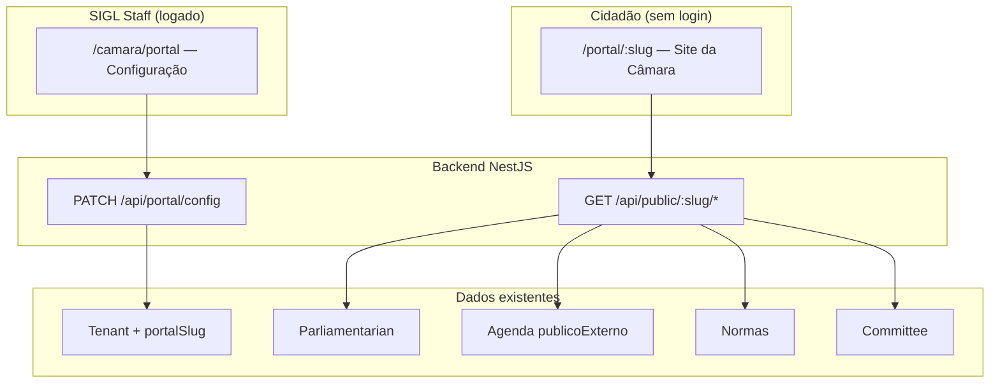

# SPEC-008 — Portal Institucional da Câmara

**Status:** Rascunho | **Versão:** 1.0
**Módulo backend:** `src/portal/`
**API prefix (staff):** `/api/portal`
**API prefix (público):** `/api/public/:slug`
**Frontend staff:** `/camara/portal` → `PortalInstitucionalPage`
**Frontend público:** `/portal/:slug/*`
**Depende de:** nenhuma TASK bloqueante de schema legislativo; hotfix multi-tenant nos endpoints públicos existentes

---

## Background

Cada tenant (câmara municipal) precisa de um **site institucional público** configurável pelo staff no SIGL, sem login. O cidadão consulta vereadores, agenda, normas e informações da casa legislativa.

Hoje existe apenas placeholder em `PortalInstitucionalPage` ("Em desenvolvimento"). Há dados e flags parciais (`AgendaLegislativa.publicoExterno`, endpoints `/public` de agenda e normas), mas **sem isolamento por tenant** e **sem API de configuração** para o staff editar o próprio tenant.

---

## Visão

Dois produtos, um backend:

| Área | Quem usa | Onde |
|------|----------|------|
| **Configuração** | `ADMIN_STAFF` | Aba `/camara/portal` no SIGL |
| **Portal público** | Cidadão (sem login) | Rotas `/portal/:slug` no frontend |



---

## Estado atual (gaps)

| Item | Situação |
|------|----------|
| `PortalInstitucionalPage` | Placeholder |
| `Tenant.settings` (Json) | Existe; staff não tem API para editar o próprio tenant |
| `GET .../agenda-legislativa/public` | Sem filtro por tenant |
| `GET .../normas/public` | Sem filtro por tenant |
| `AgendaLegislativa.publicoExterno` | Pronto; UI da agenda já menciona portal |
| Parlamentares, comissões, mesa | Só APIs autenticadas |
| Spec formal | Este documento |

**Bloqueante:** corrigir isolamento multi-tenant antes de expor páginas públicas.

---

## Decisões de arquitetura

### Identificação pública da câmara

**MVP:** coluna `Tenant.portalSlug` única (ex.: `camara-fortaleza`).

```
https://gestao-vereadores.vercel.app/portal/camara-fortaleza
https://gestao-vereadores.vercel.app/portal/camara-fortaleza/vereadores
```

Subdomínio customizado (`fortaleza.sigl.com.br`) fica para fase posterior.

### Configuração (MVP)

Coluna `portalSlug` + bloco tipado em `Tenant.settings.portal`:

```typescript
interface PortalSettings {
  ativo: boolean;
  titulo: string;
  subtitulo?: string;
  sobre?: string;
  endereco?: string;
  telefone?: string;
  email?: string;
  redesSociais?: {
    facebook?: string;
    instagram?: string;
    youtube?: string;
  };
  cores?: {
    primaria?: string;
    secundaria?: string;
  };
  bannerUrl?: string;
  secoes: {
    vereadores: boolean;
    mesaDiretora: boolean;
    comissoes: boolean;
    agenda: boolean;
    normas: boolean;
    materias: boolean;
    transmissao: boolean;
  };
  legislaturaId?: string;
}
```

**Fase 2 (CMS):** model `PortalPagina` para páginas customizadas (História, Regimento).

### Estrutura backend

```
src/portal/
├── portal.module.ts
├── application/
│   ├── controllers/
│   │   ├── portal-config.controller.ts    # staff (JWT + tenant)
│   │   └── portal-public.controller.ts    # @Public @SkipTenant
│   ├── dto/
│   ├── use-cases/
│   └── view-models/
├── domain/
│   ├── entities/portal-config.entity.ts
│   ├── services/portal-tenant-resolver.service.ts
│   └── repositories/portal-config.repository.ts
└── infra/prisma/
```

### Estrutura frontend

| Parte | Local |
|-------|--------|
| Config staff | `PortalInstitucionalPage.tsx` |
| Site público | `pages/portal/*` + `PublicPortalLayout` |
| Rotas públicas | Fora de `StaffRoute` (sem JWT) |
| API | `src/api/portal/` + `src/api/public/` |

---

## Schema (migration MVP)

```prisma
model Tenant {
  // ... campos existentes
  portalSlug String? @unique
}
```

Validar slug: lowercase, `[a-z0-9-]`, 3–60 chars, único global.

---

## API — Configuração (staff)

Guards: `@UseGuards(JwtAuthGuard, TenantGuard)` + role `ADMIN_STAFF`.
`tenantId` sempre do JWT — nunca do body.

| Método | Rota | Descrição |
|--------|------|-----------|
| GET | `/api/portal/config` | Lê config do tenant |
| PATCH | `/api/portal/config` | Atualiza `settings.portal` e/ou `portalSlug` |
| GET | `/api/portal/config/preview-url` | URL pública montada |

### View model staff (`PortalConfigViewModel`)

Expõe: `portalSlug`, `name`, `logo`, `settings.portal` (tipado).
Não expõe: `tenantId`, `isRemoved`, `removedAt`.

---

## API — Público

Decorators: `@Public()` + `@SkipTenant()`.
Resolver: `slug → tenantId`; 404 se tenant removido ou `settings.portal.ativo === false`.

| Método | Rota | Descrição |
|--------|------|-----------|
| GET | `/api/public/:slug/config` | Branding + seções habilitadas |
| GET | `/api/public/:slug/vereadores` | Lista parlamentares ativos |
| GET | `/api/public/:slug/vereadores/:id` | Perfil público |
| GET | `/api/public/:slug/agenda` | Eventos `publicoExterno: true` |
| GET | `/api/public/:slug/normas` | Normas do tenant |
| GET | `/api/public/:slug/mesa-diretora` | Se seção ativa |
| GET | `/api/public/:slug/comissoes` | Se seção ativa |

### View models públicos

Nunca expor: `tenantId`, `isRemoved`, `removedAt`, `tramitacaoJson`, `cicloVidaJson`.

### Hotfix endpoints legados

Migrar ou encapsular:

- `GET /api/legislative/agenda-legislativa/public` → exigir `:slug` ou deprecar em favor de `/api/public/:slug/agenda`
- `GET /api/normas/public` → idem

---

## Páginas públicas (frontend)

| Rota | Conteúdo |
|------|----------|
| `/portal/:slug` | Home (config + destaques agenda) |
| `/portal/:slug/vereadores` | Grid parlamentares |
| `/portal/:slug/vereadores/:id` | Perfil |
| `/portal/:slug/agenda` | Calendário/lista |
| `/portal/:slug/normas` | Legislação |
| `/portal/:slug/contato` | Dados de contato da config |

Fase 3: matérias públicas, pauta publicada, transmissão ao vivo em destaque.

---

## Fases de implementação

### Fase 0 — Fundação (bloqueante)

- Migration `portalSlug`
- `PortalTenantResolver` (slug → tenant)
- Corrigir isolamento multi-tenant nos endpoints públicos
- CORS: mesma origem Vercel do frontend

### Fase 1 — Config no SIGL

- `GET/PATCH /api/portal/config`
- UI em `PortalInstitucionalPage` (Geral, Aparência, Seções, Legislatura, Preview)

### Fase 2 — Portal MVP

- `PublicPortalLayout` + Home, Vereadores, Agenda, Normas, Contato

### Fase 3 — Conteúdo legislativo

- Mesa diretora, comissões, transmissão, matérias/pauta pública (flags de visibilidade)

### Fase 4 — Backlog

- CMS (`PortalPagina`), SEO, domínio customizado, analytics, widget embed

---

## Regras absolutas (projeto)

1. Domain layer sem `@prisma/client` / `@nestjs/*`
2. `tenantId` na config vem do JWT; slug só na API pública
3. Queries com `{ tenantId, isRemoved: false }`
4. Soft delete apenas
5. Mensagens de erro em português brasileiro
6. Sem `any` nos contratos de `settings.portal`

---

## Riscos

| Risco | Mitigação |
|-------|-----------|
| Vazamento multi-tenant | Fase 0 obrigatória |
| Slug duplicado | `@unique` + validação no PATCH |
| Portal desativado | `ativo: false` → 404 público |
| Upload banner na Vercel | URL externa no MVP |

---

## Decisões pendentes (confirmar antes de codar)

1. **Slug** — `camara-municipio` vs CNPJ na URL? (recomendado: slug)
2. **MVP seções** — Home + Vereadores + Agenda + Normas como mínimo?
3. **Deploy** — mesmo frontend Vercel ou projeto separado depois? (recomendado: mesmo repo/SPA)

---

## Task executável

Ver `backend/docs/tasks/TASK-008-portal-institucional.md`.
