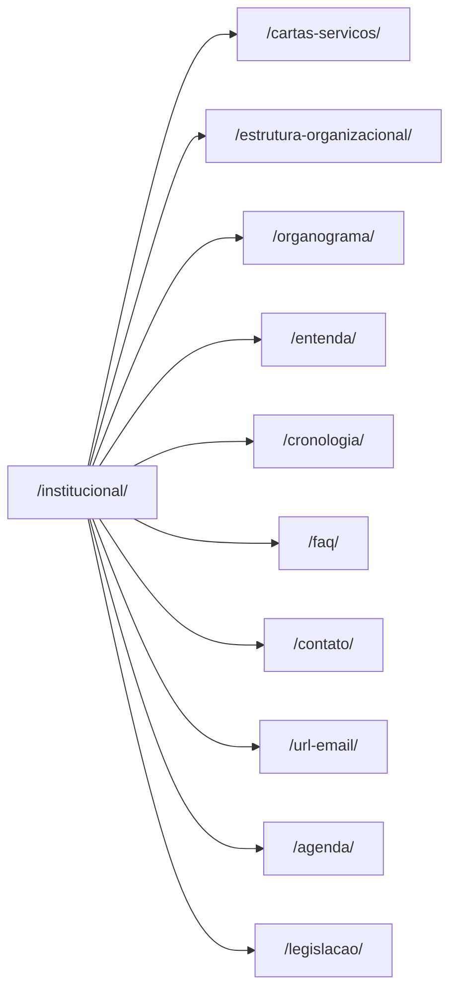
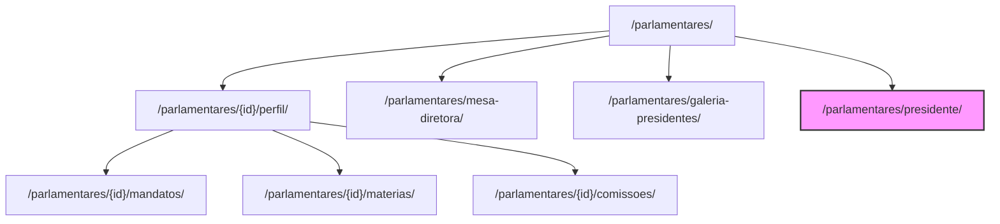
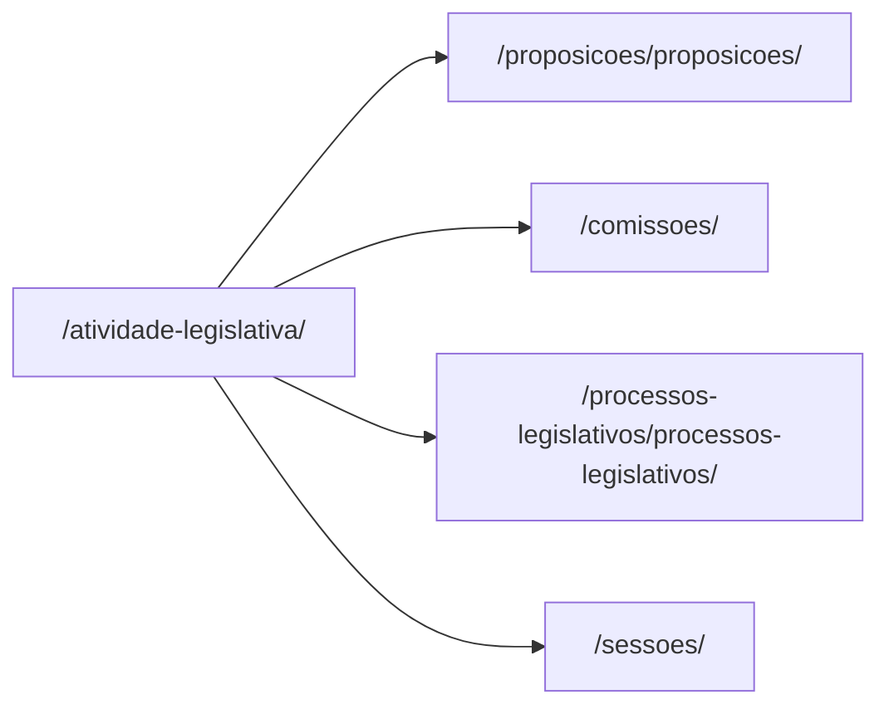
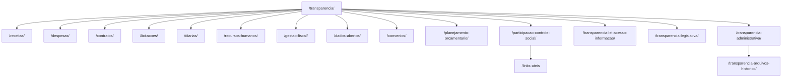
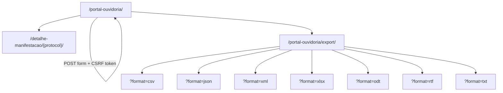
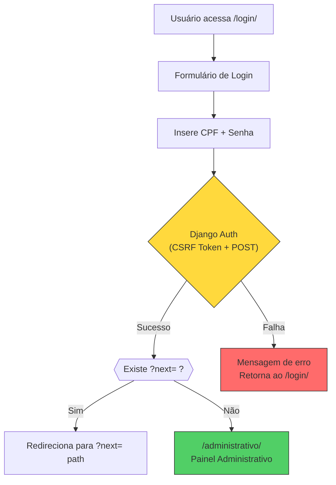

# 🗺️ Workflow Map v3 — Câmara Municipal de Baturité

**System:** SIGL — Sistema Integrado de Gestão Legislativa (IntGest)
**URL:** `https://camarabaturite.ce.intgest.com.br`
**Platform:** Django (Python), AWS S3 media, TailwindCSS + Alpine.js frontend
**Total Routes Identified:** 66+ | **Modules:** 12
**Last Updated:** 2026-06-11 v3

---

## 🏗️ Full Site Architecture

```mermaid
graph TD
    ROOT["🏠 Home /"]

    ROOT --> INST["🏛️ Institucional"]
    ROOT --> PARL["👤 Parlamentar"]
    ROOT --> ATLG["⚖️ Atividade Legislativa"]
    ROOT --> LGVO["📋 Legislativo - Alias"]
    ROOT --> LEG["📜 Legislação"]
    ROOT --> TRANSP["🔍 Transparência"]
    ROOT --> OUV["📞 Ouvidoria / E-SIC"]
    ROOT --> INFO["📂 Acesso à Informação"]
    ROOT --> ADM["🖥️ Administrativo 🔒"]
    ROOT --> ACESS["♿ Acessibilidade"]
    ROOT --> GOV["📋 Governo Digital"]
    ROOT --> AUTH["🔐 Login SIGL"]

    INST --> I1["Carta de Serviços"]
    INST --> I2["Estrutura Organizacional"]
    INST --> I3["Organograma"]
    INST --> I4["Entenda o Legislativo"]
    INST --> I5["Cronologia"]
    INST --> I6["FAQ"]
    INST --> I7["Contato"]
    INST --> I8["Email Institucional"]
    INST --> I9["Agenda"]
    INST --> I10["Legislação Institucional"]

    PARL --> P1["Lista de Vereadores"]
    PARL --> P2["Mesa Diretora"]
    PARL --> P3["Galeria Presidentes"]
    PARL --> P4["Presidente Atual - Vanity URL"]
    P1 --> P5["Perfil /{id}/perfil/"]
    P5 --> P6["Mandatos /{id}/mandatos/"]
    P5 --> P7["Matérias /{id}/materias/"]
    P5 --> P8["Comissões /{id}/comissoes/"]

    ATLG --> A1["Proposições"]
    ATLG --> A2["Comissões"]
    ATLG --> A3["Processos Legislativos"]
    ATLG --> A4["Sessões"]

    LGVO --> L1["Mesa Diretora"]
    LGVO --> L2["Sessões Plenárias"]
    LGVO --> L3["Comissões"]
    LGVO --> L4["Proposições"]

    LEG --> LG1["Lei Orgânica Municipal"]
    LEG --> LG2["Pesquisa Legislação"]

    TRANSP --> T1["Receitas"]
    TRANSP --> T2["Despesas"]
    TRANSP --> T3["Contratos"]
    TRANSP --> T4["Licitações"]
    TRANSP --> T5["Diárias"]
    TRANSP --> T6["Recursos Humanos"]
    TRANSP --> T7["Gestão Fiscal"]
    TRANSP --> T8["Dados Abertos"]
    TRANSP --> T9["Convênios"]
    TRANSP --> T10["Planejamento Orçamentário"]
    TRANSP --> T11["Links Úteis"]
    TRANSP --> T12["LAI"]
    TRANSP --> T13["Transparência Legislativa"]
    TRANSP --> T14["Transparência Administrativa"]
    TRANSP --> T15["Participação Social"]
    T14 --> T16["Arquivos Históricos"]

    OUV --> O1["Portal Ouvidoria"]
    O1 --> O2["Detalhe Manifestação"]
    O1 --> O3["Exportar Dados - 7 formatos"]

    AUTH --> ADM

    style ADM fill:#ff6b6b,stroke:#333,stroke-width:2px
    style P4 fill:#f9f,stroke:#333,stroke-width:2px
    style LGVO fill:#ffd93d,stroke:#333,stroke-width:1px
```

---

## 🏠 Root / Geral (2 rotas)

| # | Route | Method | Description |
|---|-------|--------|-------------|
| 1 | `/` | GET | Página inicial (Home) — body class: `indexview` |
| 2 | `/busca/?q={termo}` | GET | Busca geral do site |

---

## 🏛️ Módulo: Institucional (11 rotas)

| # | Route | Method | Description |
|---|-------|--------|-------------|
| 3 | `/institucional/` | GET | Página principal Institucional |
| 4 | `/institucional/cartas-servicos/` | GET | Carta de Serviços ao Cidadão |
| 5 | `/institucional/estrutura-organizacional/` | GET | Estrutura Organizacional |
| 6 | `/institucional/organograma/` | GET | Organograma |
| 7 | `/institucional/entenda/` | GET | Entenda o Legislativo |
| 8 | `/institucional/cronologia/` | GET | Cronologia da Câmara |
| 9 | `/institucional/faq/` | GET | Perguntas Frequentes |
| 10 | `/institucional/contato/` | GET | Fale com a Câmara |
| 11 | `/institucional/url-email/` | GET | Email Institucional |
| 12 | `/institucional/agenda/` | GET | Agenda de eventos e compromissos |
| 13 | `/institucional/legislacao/` | GET | Legislação institucional |

---

## 👤 Módulo: Parlamentar (8 rotas fixas + rotas dinâmicas por vereador)

| # | Route | Method | Description |
|---|-------|--------|-------------|
| 14 | `/parlamentares/` | GET | Lista de todos os Vereadores |
| 15 | `/parlamentares/{id}/perfil/` | GET | Perfil individual do parlamentar (body class: `parlamentarperfilview`) |
| 16 | `/parlamentares/{id}/mandatos/` | GET | Mandatos, Cargos e Filiações |
| 17 | `/parlamentares/{id}/materias/` | GET | Matérias/Proposições do parlamentar |
| 18 | `/parlamentares/{id}/comissoes/` | GET | Comissões e Relatorias |
| 19 | `/parlamentares/mesa-diretora/` | GET | Mesa Diretora (body class: `mesadiretoraview`) |
| 20 | `/parlamentares/galeria-presidentes/` | GET | Galeria de presidentes da Câmara |
| 21 | `/parlamentares/presidente/` | GET | Vanity URL do presidente atual (renderiza perfil do ID 14) |

---

### 🏛️ Presidente vs Vereador Regular — Análise Comparativa

> **CONCLUSÃO:** A página do presidente usa o **mesmo template** (`parlamentarperfilview`) dos vereadores regulares.
> É essencialmente um wrapper/vanity URL que renderiza o perfil do ID 14 com um breadcrumb diferenciado.
> **Não existem seções, badges, ou funcionalidades exclusivas do presidente no portal público.**

| Aspecto | `/parlamentares/presidente/` (Presidente) | `/parlamentares/{id}/perfil/` (Vereador Regular) |
|---------|------------------------------------------|-------------------------------------------------|
| **Rota** | Vanity URL dedicada | URL baseada em ID |
| **Template HTML** | `parlamentarperfilview` | `parlamentarperfilview` ✅ **Igual** |
| **Abas do Perfil** | Perfil, Mandatos, Matérias, Comissões | ✅ **Idênticas** |
| **Seções do Corpo** | Biografia, Atuação no Plenário, Agenda, Info Pessoal, Siga por Email | ✅ **Idênticas** |
| **Breadcrumb** | **"PRESIDENTE JOÃO PAULO FARIAS LOPES"** com referência à legislatura | Nome simples do vereador (sem título) |
| **Footer** | Link "Presidência" apontando para `/parlamentares/14/perfil/` | Sem link "Presidência" |
| **Links das abas** | Apontam para `/parlamentares/14/*` (ID-based) | Apontam para `/parlamentares/{id}/*` |
| **Seções extras** | ❌ Nenhuma seção adicional | — |
| **Badges/Labels especiais** | ❌ Nenhum badge especial no corpo da página | — |
| **Estatísticas visíveis** | Propostas: 83, Relatadas: 0, Votações: 0, Discursos: 0 | Mesmo formato de estatísticas |

---

### 📋 Lista Completa de Vereadores — 6ª Legislatura (2025–2028)

**Total: 14 membros identificados**

| ID | Nome | Partido | Cargo na Mesa Diretora | Perfil URL |
|----|------|---------|------------------------|------------|
| 3 | GILDO DOS CANDEIAS | — | — | `/parlamentares/3/perfil/` |
| 5 | LUCIANO GOMES FURTADO | — | ✅ Membro Mesa Diretora | `/parlamentares/5/perfil/` |
| 12 | MARIA DO SOCORRO ARAÚJO LIMA | REPUBLICANOS | — | `/parlamentares/12/perfil/` |
| **14** | **JOÃO PAULO FARIAS LOPES** | **REPUBLICANOS** | **🏛️ PRESIDENTE** | **`/parlamentares/14/perfil/`** |
| 17 | VALDEREZ LOPES DE OLIVEIRA | — | — | `/parlamentares/17/perfil/` |
| 21 | WILLIAM MACIEL DE SOUZA | — | ✅ Membro Mesa Diretora | `/parlamentares/21/perfil/` |
| 22 | ROSE DA UPA | — | — | `/parlamentares/22/perfil/` |
| 30 | MARIA RANIELE JARDIM LIMA | — | — | `/parlamentares/30/perfil/` |
| 31 | GEOVANE DA SILVA UCHOA | PL | — | `/parlamentares/31/perfil/` |
| 32 | LINDOMAR DA SILVA SOARES | — | — | `/parlamentares/32/perfil/` |
| 33 | JOANA FURTADO DE FIGUEIREDO NETA | — | ✅ Membro Mesa Diretora | `/parlamentares/33/perfil/` |
| 34 | JAILSON DOS SANTOS PEREIRA | — | — | `/parlamentares/34/perfil/` |
| 36 | GILMÁRIO DA SAÚDE | — | — | `/parlamentares/36/perfil/` |
| 39 | AILO DO CARMO | PRB | — | `/parlamentares/39/perfil/` |

**Mesa Diretora (4 membros):** IDs 14 (Presidente), 5, 21, 33

---

### 📊 Atuação do Presidente no Plenário (dados visíveis)

| Indicador | Valor |
|-----------|-------|
| Propostas Legislativas de autoria | **83** |
| Propostas relatadas | 0 |
| Votações Nominais em plenário | 0 |
| Discursos em plenário | 0 |

---

## ⚖️ Módulo: Atividade Legislativa (5 rotas)

> **⚠️ ROTEAMENTO DUAL:** O sistema possui dois conjuntos de rotas paralelos para funcionalidades legislativas:
> - `/atividade-legislativa/...` → **Rota principal** (vinculada no mega-menu de navegação)
> - `/legislativo/...` → **Rota alias/legada** (pode coexistir e apontar para o mesmo conteúdo)

| # | Route | Method | Description |
|---|-------|--------|-------------|
| 22 | `/atividade-legislativa/` | GET | Atividade Legislativa (visão geral) |
| 23 | `/atividade-legislativa/proposicoes/proposicoes/` | GET | Proposições (projetos de lei, requerimentos, indicações) |
| 24 | `/atividade-legislativa/comissoes/` | GET | Comissões Parlamentares |
| 25 | `/atividade-legislativa/processos-legislativos/processos-legislativos/` | GET | Processos Legislativos |
| 26 | `/atividade-legislativa/sessoes/` | GET | Sessões Plenárias |

---

## 📋 Módulo: Legislativo — Rotas Alias/Legadas (4 rotas)

> **NOTA:** Estas são rotas alternativas/legadas que podem coexistir com as de `/atividade-legislativa/`.

| # | Route | Method | Description |
|---|-------|--------|-------------|
| 27 | `/legislativo/mesa-diretora/` | GET | Mesa Diretora (alias) |
| 28 | `/legislativo/sessoes-plenarias/` | GET | Sessões Plenárias (alias) |
| 29 | `/legislativo/comissoes/` | GET | Comissões (alias) |
| 30 | `/legislativo/proposicoes/` | GET | Proposições (alias) |

---

## 📜 Módulo: Legislação (3 rotas)

| # | Route | Method | Description |
|---|-------|--------|-------------|
| 31 | `/legislacao/` | GET | Página principal de Legislação |
| 32 | `/legislacao/lei-organica-municipal/?esfera_federacao=M` | GET | Lei Orgânica Municipal |
| 33 | `/legislacao-municipal/?pesquisar={termo}` | GET | Pesquisa na legislação municipal |

---

## 🔍 Módulo: Transparência (17 rotas)

| # | Route | Method | Description |
|---|-------|--------|-------------|
| 34 | `/transparencia/` | GET | Portal da Transparência (página principal) |
| 35 | `/transparencia/receitas/` | GET | Receitas públicas |
| 36 | `/transparencia/despesas/` | GET | Despesas públicas |
| 37 | `/transparencia/contratos/` | GET | Contratos firmados |
| 38 | `/transparencia/licitacoes/` | GET | Processos licitatórios |
| 39 | `/transparencia/diarias/` | GET | Diárias pagas |
| 40 | `/transparencia/recursos-humanos/` | GET | RH / Folha de pagamento |
| 41 | `/transparencia/gestao-fiscal/` | GET | Gestão Fiscal (RGF, LRF) |
| 42 | `/transparencia/dados-abertos/` | GET | Dados Abertos |
| 43 | `/transparencia/convenios/` | GET | Convênios |
| 44 | `/transparencia/planejamento-orcamentario/` | GET | Planejamento Orçamentário (LOA, LDO, PPA) |
| 45 | `/transparencia/participacao-controle-social/` | GET | Participação e Controle Social (principal) |
| 46 | `/transparencia/participacao-controle-social/links-uteis` | GET | Links Úteis |
| 47 | `/transparencia/transparencia-lei-acesso-informacao/` | GET | LAI — Lei de Acesso à Informação |
| 48 | `/transparencia/transparencia-legislativa/` | GET | Transparência Legislativa |
| 49 | `/transparencia/transparencia-administrativa/` | GET | Transparência Administrativa |
| 50 | `/transparencia/transparencia-administrativa/transparencia-arquivos-historico/` | GET | Arquivos Históricos |

---

## 📞 Módulo: Ouvidoria / E-SIC (10 rotas)

| # | Route | Method | Description |
|---|-------|--------|-------------|
| 51 | `/portal-ouvidoria/` | GET/POST | Portal da Ouvidoria (formulário POST + CSRF) |
| 52 | `/detalhe-manifestacao/{protocol}/` | GET | Detalhes de manifestação (protocol: `XXXXXXXX-XXXX`) |
| 53 | `/portal-ouvidoria/export/?format=csv` | GET | Exportar dados — CSV |
| 54 | `/portal-ouvidoria/export/?format=json` | GET | Exportar dados — JSON |
| 55 | `/portal-ouvidoria/export/?format=xml` | GET | Exportar dados — XML |
| 56 | `/portal-ouvidoria/export/?format=xlsx` | GET | Exportar dados — XLSX |
| 57 | `/portal-ouvidoria/export/?format=odt` | GET | Exportar dados — ODT |
| 58 | `/portal-ouvidoria/export/?format=rtf` | GET | Exportar dados — RTF |
| 59 | `/portal-ouvidoria/export/?format=txt` | GET | Exportar dados — TXT |

---

## 📂 Módulo: Acesso à Informação (1 rota)

| # | Route | Method | Description |
|---|-------|--------|-------------|
| 60 | `/acesso-a-informacao/` | GET | Acesso à Informação (LAI) |

---

## 🖥️ Módulo: Administrativo (1 rota pública — 🔒 autenticação necessária)

| # | Route | Method | Description |
|---|-------|--------|-------------|
| 61 | `/administrativo/` | GET | Painel Administrativo (requer login) |

> **⚠️ ATENÇÃO:** As rotas internas do painel administrativo (`/administrativo/`) **ainda não foram mapeadas**.
> Toda a área de gestão do SIGL (gerenciamento de conteúdo, configurações, publicações, usuários, etc.)
> está atrás de autenticação e requer navegação manual logada para mapeamento completo.
> Para completar, exportar um HAR file ou compartilhar screenshots da área logada.

---

## ♿ Módulo: Acessibilidade (1 rota)

| # | Route | Method | Description |
|---|-------|--------|-------------|
| 62 | `/acessibilidade/acessibilidade/acessibilidade/` | GET | Página de Acessibilidade |

---

## 📋 Módulo: Governo Digital / Termos (2 rotas)

| # | Route | Method | Description |
|---|-------|--------|-------------|
| 63 | `/lei-governo-digital/` | GET | Lei de Governo Digital |
| 64 | `/termos-politicas-uso-privacidade/` | GET | Termos de Uso e Políticas de Privacidade |

---

## 🔐 Módulo: Autenticação (2 rotas)

| # | Route | Method | Description |
|---|-------|--------|-------------|
| 65 | `/login/` | GET/POST | Login SIGL (CPF + Senha, formulário POST com CSRF token) |
| 66 | `/login/?next={redirect_path}` | GET | Login com redirecionamento automático após autenticação |

### Fluxo de Autenticação

**Padrões de redirect observados:**
- `/login/?next=/portal-ouvidoria/#consultar_manifestacao` — Login para consultar manifestações na Ouvidoria

---

## 🧩 Tech Stack Completa

| Camada | Tecnologia | Detalhes |
|--------|-----------|---------|
| **Backend Framework** | Python / Django | CSRF middleware, session-based auth, template engine, class-based views |
| **Frontend CSS** | TailwindCSS (CDN) | Utilizado no portal público e tela de login |
| **Frontend JS** | Alpine.js | Diretivas `x-data`, `x-cloak`, componentes reativos |
| **UI Components** | Flowbite 1.6.5 | Biblioteca de componentes baseada em TailwindCSS |
| **Typography** | Montserrat (primária), Roboto (fallback) | Carregadas via Google Fonts |
| **Icons** | FontAwesome Pro 6.1.1 | Conjuntos Duotone + Solid |
| **Media Storage** | AWS S3 | Bucket: `intellgest-sigl-media.s3.amazonaws.com` |
| **Image Carousel** | Owl Carousel + Swiper | Carrosséis de imagens e cards |
| **Accessibility** | VLibras | Widget de tradução para Libras (Língua Brasileira de Sinais) |
| **Analytics** | Google Analytics / GTM | Integração via Google Tag Manager |
| **Social Integration** | Facebook SDK v13.0 | Compartilhamento social, App ID: `846747429220403` |
| **UI Range Slider** | noUiSlider | Componente de slider para filtros numéricos |
| **SEO** | Schema.org JSON-LD | GovernmentOrganization, WebSite, WebPage, BreadcrumbList, SearchAction |
| **CSS Variables** | Custom Properties | `--primary-color: #017D42`, `--secondary-color: #3D4095` |
| **Platform** | IntGest SIGL | Sistema Integrado de Gestão Legislativa (SaaS) |

---

## 📊 Django View Classes Identificadas (via body class)

| Body Class CSS | View Name (inferido) | Route | Descrição |
|---------------|---------------------|-------|-----------|
| `indexview` | `IndexView` | `/` | Página inicial do portal |
| `parlamentarperfilview` | `ParlamentarPerfilView` | `/parlamentares/{id}/perfil/` | Perfil do parlamentar (inclui presidente) |
| `mesadiretoraview` | `MesaDiretoraView` | `/parlamentares/mesa-diretora/` | Mesa Diretora do legislativo |

---

## 📊 Resumo Final por Módulo

| # | Módulo | Qtd. Rotas | Numeração | Status |
|---|--------|-----------|-----------|--------|
| 1 | **Geral (Root)** | 2 | #1–#2 | ✅ Mapeado |
| 2 | **Institucional** | 11 | #3–#13 | ✅ Mapeado |
| 3 | **Parlamentar** | 8 fixas + dinâmicas | #14–#21 | ✅ Mapeado |
| 4 | **Atividade Legislativa** | 5 | #22–#26 | ✅ Mapeado |
| 5 | **Legislativo (alias)** | 4 | #27–#30 | ✅ Mapeado |
| 6 | **Legislação** | 3 | #31–#33 | ✅ Mapeado |
| 7 | **Transparência** | 17 | #34–#50 | ✅ Mapeado |
| 8 | **Ouvidoria / E-SIC** | 9 | #51–#59 | ✅ Mapeado |
| 9 | **Acesso à Informação** | 1 | #60 | ✅ Mapeado |
| 10 | **Administrativo** | 1 🔒 | #61 | ⚠️ Parcial — rotas internas pendentes |
| 11 | **Acessibilidade** | 1 | #62 | ✅ Mapeado |
| 12 | **Governo Digital / Termos** | 2 | #63–#64 | ✅ Mapeado |
| 13 | **Autenticação** | 2 | #65–#66 | ✅ Mapeado |
| | **TOTAL** | **66+** | | |

---

## 🔎 Descobertas Importantes

### 1. Presidente = Mesmo Template
A rota `/parlamentares/presidente/` renderiza o **mesmo template** `parlamentarperfilview` que qualquer vereador regular. A única diferença visual é o **breadcrumb** com o título "PRESIDENTE". Não há seções, badges, ou funcionalidades exclusivas do presidente no portal público. A página é um **vanity URL/wrapper** que renderiza o conteúdo do ID 14.

### 2. Roteamento Dual (Legislativo)
O sistema possui rotas paralelas para funcionalidades legislativas:
- `/legislativo/...` → Rota legada/alias
- `/atividade-legislativa/...` → Rota principal (vinculada no mega-menu)

Ambos os conjuntos podem coexistir e apontar para o mesmo conteúdo.

### 3. API de Exportação da Ouvidoria
O módulo Ouvidoria expõe uma API de exportação de dados em **7 formatos** via `/portal-ouvidoria/export/?format=` (CSV, JSON, XML, XLSX, ODT, RTF, TXT).

### 4. Correção de Rotas Parlamentares
As abas do perfil parlamentar usam `/parlamentares/{id}/mandatos/` (não `/parlamentar/{id}/portal/mandatos/` como havia sido identificado inicialmente pela URL fornecida).

### 5. Rotas Não Mapeadas (Área Autenticada)
O painel `/administrativo/` e todas as rotas internas do SIGL (gerenciamento de conteúdo, configurações, publicações, permissões de usuários, etc.) requerem navegação autenticada para mapeamento completo. Estas rotas podem ser mapeadas via:
- Exportação de HAR file durante navegação logada
- Screenshots do menu/sidebar do painel administrativo
- Análise do código-fonte do backend (se disponível)

---

## 📝 Changelog

| Versão | Data | Alterações |
|--------|------|------------|
| v1 | 2026-06-11 | Mapeamento inicial — 42 rotas, 10 módulos |
| v2 | 2026-06-11 | +25 rotas, 14 vereadores com IDs, roteamento dual, API ouvidoria |
| v3 | 2026-06-11 | Comparação Presidente vs Vereador, Mesa Diretora, correção de rotas, view classes Django, +3 novas rotas |
