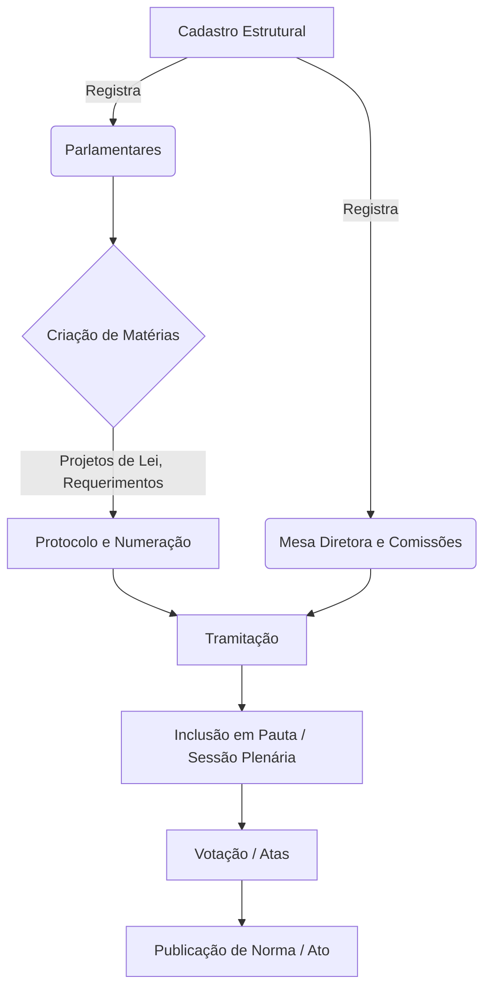
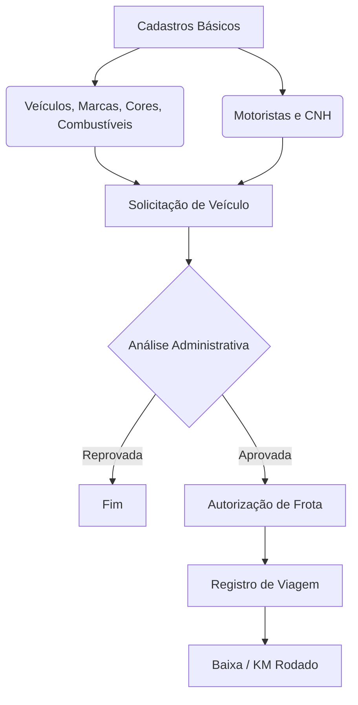
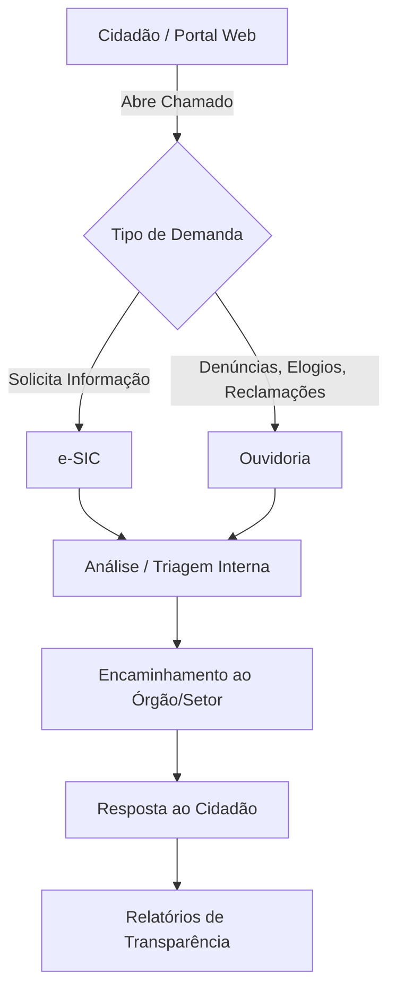
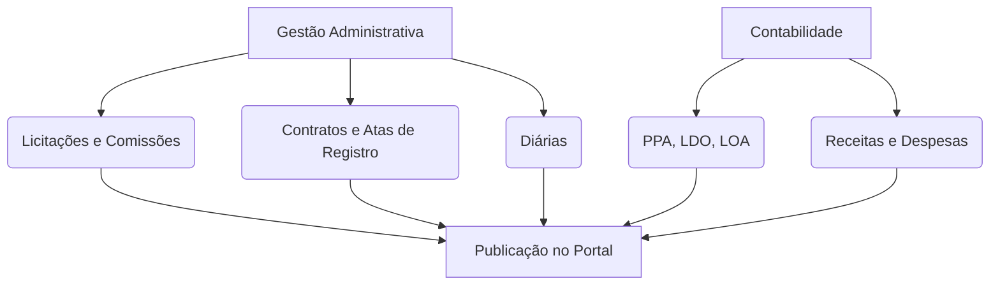

# Mapeamento de Fluxos de Trabalho (Workflows da Plataforma)

Com base na engenharia reversa dos menus, telas e formulários do sistema IntGest (Câmara Municipal de Baturité), foram identificados os macro-fluxos (User Journeys) que ditam as regras de negócio da plataforma. 

Abaixo estão detalhados os principais fluxos de trabalho do sistema.

---

## 1. Fluxo de Atividade Legislativa (Core Business)
Este é o fluxo principal da Câmara, focado na gestão das leis, projetos e sessões plenárias.

**Passo a Passo do Fluxo Legislativo:**
1. **Cadastros Básicos:** O sistema exige o cadastro prévio de Parlamentares, formação de Comissões e Composição da Mesa Diretora.
2. **Entrada de Matérias:** Cria-se a "Matéria" (Projeto de Lei, Requerimento, Indicação), vinculando o Autor (Parlamentar ou Executivo).
3. **Tramitação:** A matéria tramita pelas comissões, recebendo pareceres.
4. **Sessão Plenária:** A matéria é inserida na pauta de uma Sessão Plenária, onde ocorrem as presenças e votações.
5. **Efetivação:** Uma vez aprovada, a matéria vira uma Norma ou Ato e é publicada no Portal.

---

## 2. Fluxo de Gestão de Frota (Logística)
Módulo dedicado ao controle dos veículos oficiais e autorizações de saída.

**Passo a Passo da Frota:**
1. **Estruturação:** Cadastram-se os veículos (com implementos, bombas, capacidades) e os motoristas.
2. **Solicitação:** Um usuário administrativo cria uma `Solicitação` de deslocamento.
3. **Autorização:** A solicitação passa por aprovação, gerando uma `Autorização`.
4. **Viagem:** A autorização se desdobra em uma `Viagem`, onde possivelmente se registra o KM de saída e retorno, e os abastecimentos.

---

## 3. Fluxo de Atendimento ao Cidadão (e-SIC e Ouvidoria)
Fluxo voltado para a transparência e cumprimento da Lei de Acesso à Informação.

**Passo a Passo do Cidadão:**
1. **Entrada:** Configuram-se os canais de atendimento e entrada de pedidos.
2. **Protocolo:** O pedido via e-SIC ou Manifestação via Ouvidoria gera um protocolo.
3. **Tramitação:** O pedido tramita internamente (mudanças de status).
4. **Resposta e Encerramento:** O cidadão é respondido, e os dados alimentam o módulo de "Relatórios de Ouvidoria" e "Portal Social".

---

## 4. Fluxo de Transparência Administrativa e Financeira
Fluxo de backoffice para manter o Portal da Transparência atualizado.

**Passo a Passo Administrativo:**
1. **Despesas e Planejamento:** São inseridos no sistema os instrumentos de planejamento (PPA, LDO, LOA) e as receitas/despesas da Câmara.
2. **Compras:** Módulo de Licitações recebe os editais, andamentos das comissões, e evolui para a assinatura de Contratos e Atas de Registro de Preço.
3. **Recursos Humanos:** Registro e aprovação de Diárias para servidores e parlamentares.
4. **Publicidade:** Tudo é amarrado às configurações do "Portal Institucional", alimentando murais, banners, vídeos e páginas públicas.

---

## Resumo da Arquitetura de Fluxos
A plataforma IntGest é, em essência, um **ERP Legislativo** que consolida processos de backoffice (compras, frota, diárias) com o core-business das Câmaras Municipais (tramitação de matérias e sessões). Todos os módulos convergem para o **Portal Institucional/Transparência**, garantindo publicidade aos atos.
